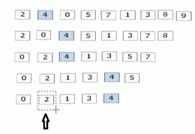

- [数据类型](#数据类型)
- [运算符](#运算符)
- [程序结构](#程序结构)
- [数组](#数组)
- [函数](#函数)
- [指针](#指针)
- [结构体](#结构体)
- [内存](#内存)
  - [new](#new)
- [引用(给变量起别名)](#引用给变量起别名)
- [函数高级](#函数高级)
  - [函数的默认参数](#函数的默认参数)
  - [函数的占位参数](#函数的占位参数)
  - [函数重载](#函数重载)
- [类\&对象](#类对象)
  - [封装](#封装)
  - [对象](#对象)
  - [友元](#友元)
  - [运算符重载](#运算符重载)
    - [加号运算符重载](#加号运算符重载)
    - [左移运算符重载](#左移运算符重载)
    - [递增运算符重载](#递增运算符重载)
    - [赋值运算符重载](#赋值运算符重载)
    - [关系运算符重载](#关系运算符重载)
    - [函数调用运算符重载(仿函数)](#函数调用运算符重载仿函数)
>>>>>>> 66ca5a563298b326a91148b14f89b66cf3728062

```text
生成目录 ctrl+shift+p Markdown: Create Table of Contents
更新目录 自动更新 或手动更新 ctrl+shift+p Markdown: Update Table of Contents
```

## 数据类型
内存占用
```cpp
short 2字节
int   4字节
long  win为4字节 linux为4字节(32位)和8字节(64位)
long long   8字节
float 4字节
double 8字节
char 1字节
```
sizeof()
```cpp
int a = 10;
cout << sizof(short) <<endl;
cout << sizeof(a) << endl;
```
定义
```cpp
float c = 1.11;//默认为double，此操作将c转为float
float d = 1.11f;

//科学计数法
float f1 = 3e2;//3*10^2
float f2 = 3e-3;//3*10^-3

char ch = 'a';//只能有一个字符，且只能用单引号
//字符型变量char 并不是把字符本身放到内存中存储，而是将对应的ASCII编码放入到存储单元 a-97 A-65
int ass = int(ch);//97

//字符串
char str[] = "hello";
//或
#include <string>
string str1 = "hello";

//布尔
bool flag = true;
//打印输出为1
cout <<flag << endl;
```
数据输入
```cpp
int a = 0;
cin >> a;
//输入bool型时，只接受数字，不接收true/false  
```
\n换行 \t水平制表 \\转义

## 运算符
前置++
```cpp
//先+1，后运算表达式
int a = 10;
int b = ++a;
cout << b << endl;//b = 11
```
后置++
```cpp
//先进行表达式运算，后+1
int a = 10;
int b = a++;
cout << b << endl;//b = 10
```

## 程序结构
 if
 ```cpp
if(a>b){
    cout << a;
}
 ```
 三目运算符
 ```cpp
int a = 10;
int b = 20;
int c = 0;
c = a>b ? a:b;
//a>b成立则c=a a>b不成立则c=b
 ```
 switch
 ```cpp
switch(){
    case 1:a++;break;
    case 2:a--;break;
    default:a=b;break;
}
//不加break的话，倘若case为2，会运行a-- 和 a=b。
//switch相比if 执行效率高
 ``` 
 while和do_while
```cpp
int num = 0; 
//do_while先执行一次循环语句再判断循环条件 且dowhile的while后要加一个;
do{
    cout << num << endl;
    num++;
}while(num<10);
//while
while(num<10){
    cout << num << endl;
    num++;
}
```
水仙花数
```cpp
# 1^3+5^3+3^3=153
#include <iostream>
using namespace std;

int main(){
    int a =100;
    do{
        int bai = a/100;
        int shi = a%100/10;// a/10%10
        int ge = a&10;
        if(bai*bai*bai+shi*shi*shi+ge*ge*ge == a){
            cout << a << endl;
        }
        a++;
    }while(a<1000);
}
```
for
```cpp
for(int i = 0;i<100;i++){
    
}
```
9x9
```cpp
for(int i = 1 ;i<10;i++){
    for(int j = 1;j<=i;j++){
        //cout <<i "*" j = i*j >> endl;
        cout <<i << " * " << j << " = " << i*j << endl;
    }
    cout << endl;
}
```
break 直接结束此层循环
```cpp
for (int i=0;i<100;i++){
    if(i=10){
        break;
    }
}
```
continue 跳过此次循环的剩余代码，进入下一轮循环
```cpp
for(int i=0;i<10;i++){
    for(int j=0;j<10;j++){
        if(j=5){
            continue;
        }
        cout <<i << endl;
    }
}
```
goto
```cpp
cout << "1"<< endl;
cout << "2"<< endl;
goto FLAG;
cout << "3"<< endl;
cout << "4"<< endl;
FLAG:
cout << "5"<< endl;
```
## 数组
定义
```cpp
int arr1[];
int arr2[10]={};
int arr3[]={1,2,3,4,5};
```
sizeof
```cpp
sizeof(arr1);//统计整个数组在内存中的长度
sizeof(arr1[0]);//首个元素的内存占用长度
sizeof(arr1)/sizeof(arr1[0]);//二者结合可知数组长度
cout<<arr1 << endl;//打印出数组的首地址
```
元素逆置
```cpp
//法一
int arr1[5] = {1,2,3,4,5};
int end = sizeof(arr1)/sizeof(arr1[0]);
int num1;
for(int i=0;i<(end/2);i++){
    num1 = arr1[i];
    arr1[i]=arr1[end-1-i];
    arr1[end-1-i]=num1;
}
for(int i=0;i<=(end-1);i++){
    cout<< arr1[i] << endl;
}

//法二
int arr2[5]={1,2,3,4,5}
int end2 = sizeof(arr1)/sizeof(arr1[0]);
int num2;
for(int i =0;i<end2;i++){
    num2 = arr2[i];
    arr2[i] = arr2[end2-1];
    arr2[end2-1] = num2;
    end2--;
}
for(int i=0;i<=(end2-1);i++){
    cout<< arr2[i] << endl;
}

//法三
int arr3[5] = {1,2,3,4,5};
int end3 = sizeof(arr3)/sizeof(arr3[0]) - 1;
int num3;
int len = sizeof(arr1)/sizeof(arr1[0]);
int start3 = 0;
while(start3<end3){
    num3 = arr3[start3];
    arr3[start3] = arr3[end3];
    arr3[end3] = num3;
    end3--;
    start3++;
}
for(int i=0;i<len;i++){
    cout << arr3[i];
}
```
冒泡排序



```text
排序总轮数 = 元素个数 - 1
每轮对比次数 = 元素个数 - 排序轮数 - 1
```
```cpp
int arr0[] = {5,0,6,3,7,1,8,9};
len = sizeof(arr0)/sizeof(arr0[0]);
int max;
for(int i=0;i<len-1;i++0){
    for(int j=0;j<len-i-1;j++){
        if (arr0[j]>arr0[j+1]){
            max = arr0[j];
            arr0[j] = arr0[j+1];
            arr0[j+1] = max;
        }
    }
}
for(int i=0;i<len;i++){
    cout << arro[i];
}
```
二维数组
```cpp
 int arr[2][3] = {{1,2,3},{4,5,6}};//{1,2,3,4,5,6}也可以
 int arr1[][3] = {1,2,3,4,5,6,7,8,9};//行数可以省略，列数不可以省略
//遍历
for(int i=0;i<2;i++){ 
    for(int j=0;j<3;j++){
        cout << arr[i][j] << endl;
    }
}   
//取某个元素的首地址时需要加取址符 & 
cout << (int)&arr[0][0] << endl;
```
## 函数
程序从上往下读，如果函数定义在调用之后，那么需要提前声明
```cpp
#include <iostream>
using namespace std;

int max();

int main(){
    return 0;
}
int max(){
    return 0;
}
```
分文件编写函数
```text
建一个.h文件用于写声明
建一个cpp文件用于写定义  顶部引用头文件#include "swap.h"
```
## 指针
定义
```cpp
int a = 10;
int * p = &a; //32位win占4字节   64位win占8字节 不管是什么数据类型(int/float/double)
cout << p << " " << &a << endl;
```
解引用 *p -> p指向的数值
```cpp
int a = 100;
int * p = &a;
*p = 1000;
cout << a <<" " << *p << endl; 
```
空指针
```text
初始化指针变量
且空指针指向的内存无法访问
内存编号0~255为系统占用内存，不允许用户访问
```
```cpp
int *p = NULL;
```
野指针
```text
指针变量指向非法的内存空间，访问会出错
```
const
```cpp
//常量指针(修饰指针)  指针的指向可以更改，但指针指向的值不可更改
int a = 10;
int b = 20;
const int *p = &a;
p = &b;
//*p = 30;错误

//指针常量(修饰常量) 指针指向不可改，指向的值可以改
int a = 10;
int b = 20;
int * const p = &a;
*p = 30;
//p = &b;错误

//const既修饰指针也修饰常量   两个都不可以改
int a = 10;
int b = 20;
const int * const p = &a;
//p = &b;错误
//*p = 30;错误
```
指针访问数组元素
```cpp
int arr[10] = {1,2,3,4,5,6,7,8,9,10};
int *p = arr;
cout << "第一个元素为：" << arr[0] << endl;//1
cout << "利用指针访问第一个元素" << *p << endl;//1
p++;//让指针向后偏移四个字节(智能识别步长，若为char *p 则p++代表偏移一个字节)
cout << "利用指针访问第二个元素：" << *p << endl;//2
```  
指针遍历数组
```cpp
int arr[10] = {1,2,3,4,5,6,7,8,9,10};
int *p = arr;
for(int i = 0;i<10;i++){
    cout << *p << endl;
    p++;
}
```
指针和函数
```cpp
//值传递不会改变实参数据
//地址传递可以实现改变实参数据
void swap(int *p1,int *p2){
    int temp = *p1;
    *p1 = *p2; 
    *p2 = temp;
    cout << *p1 << *p2 << endl;// 20 10
}
int main(){
    int a = 10;
    int b = 20;
    swap(&a,&b);
    cout << a << b << endl;//20 10
}
```
## 结构体
定义
```cpp
#include <iostream>
using namespace std;
#include <string> //cout << name

struct Student{
    string name;
    int age;
    int score;
}; // ;不要漏

int main(){
    struct Student s1;//创建结构体对象时，struct可以省略，即Student s1
    s1.name = "mike";
    s1.age = 11;
    s1.score = 100;
    cout << "name" << s1.name << "age" << s1.age << "score" << s1.score;
    
    struct Student s2 = {"jack",12,200};

} 
``
结构体数组
```cpp
struct Student{
    string name;
    int age;
    int score;
};

int main(){
    struct Student stuArray[]={
        {"mike",10,200},
        {"jack",21,130},
        {"lucy",30,90}
    };
    stuArray[2].name = "niko";

}
```
结构体指针
```cpp
struct Student{
    string name;
    int age;
    int score;
};

int main(){
    Student s = {"mike",11,100};
    Student *p = &s;//s是student型变量
    cout << p->name 
}
```
结构体嵌套结构体
```cpp
#include <iostream>
using namespace std;
#include <string> //cout << name

struct Student{
    int score;
    int age;
    string name;
};
struct Teacher{
    string name;
    int age;
    int id;
    Student stu;
};

int main(){
    Teacher t;
    t.id = 1001;
    t.age = 20;
    t.name = "mike";
    t.stu.name = "jack";
    t.stu.age = 10;
    t.stu.score = 100;
    cout << "teacher name:" << t.name << ", age:" << t.age << ", id:" << t.id << endl;
    cout << "stu.name:" << t.stu.name << ", stu.age:" << t.stu.age << ", stu.score:" << t.stu.score << endl;
}
```
结构体作为参数
```cpp
//值传递
void test1(struct student s){
    cout << s.name;
}

//地址传递
void test2(struct student *p){
    cout << p->name;
}

int main(){
    Student s1 = {"mike",11,200};
    test1(s1);
    test2(&s1);
}
```
const应用于结构体(常量指针)
```cpp
void test1(const Student *s){
      
}
//用常量指针每次只传递一个指针，仅4字节，而值传递则会复制整个结构体的数据过去。相比之下速度更快且能防止栈溢出
//相比于指针，常量指针不会改变实参的值
```
随机数
```cpp
#include <ctime>

srand((unsigned int)time(NULL));
int random = rand()%61+40//rand()%61 表0到60的随机数
```
## 内存
cpp程序运行时内存分区
```text
代码区 : 存放函数体的二进制代码  (共享 只读)   
全局区 : 存放全局变量、静态变量、常量
栈区 : 由编译器自动分配释放，存放函数的参数值，局部变量等 (不要返回局部变量的地址)
堆区 : 由程序员分配释放，若程序员不操作，程序结束时由操作系统回收
```
不要返回局部变量的地址
```cpp
int * func(){
    int a = 10;
    return &a;
}
int main(){
    int *p = func();
    cout << *p << endl;//第一次可以打印出正确的数字10
    cout << *p << endl;//第二次数据不再保留
}
```
利用new关键字，可以将数据开辟到堆区->可以返回局部变量的地址
```cpp
int * func(){
    int *p = new int(10);
    //new会返回开辟出的内存的地址(即返回new的类型的指针)，10代表将此数据赋初值
    return p; 
}
int main(){
    int *p = func();
    cout  << *p << endl;
    cout  << *p << endl;//均能成功返回数据10

}
```
### new
new的基本语法(new什么数据，就会返回个什么类型的指针)
```cpp
int * func(){
    int *p = new int(10);
    return p; 
}
void test1(){
    int *p = func();
    cout  << *p << endl;
    cout  << *p << endl;
    //堆区的数据由程序员管理开辟，程序员管理释放
    //释放堆区数据用delete
    delete p;
    cout  << *p << endl;//报错，内存已释放，无法访问
}
void test2(){
    //在堆区中new开辟数组
    new int[10];//10代表有10个元素，(10)代表赋初值10
    for(int i=0;i<10;i++){
        arr[i] = i+100;
    }
    for(int i=0;i<10;i++){
       cout << arr[i] <<endl;//可正常输出
    } 
    //释放堆区数组的内存,加上中括号
    delete[] arr;
    for(int i=0;i<10;i++){
       cout << arr[i] <<endl;//内存已释放，无法访问
    }

}
int main(){
    test1();
    test2();
}
```
## 引用(给变量起别名)
数据类型 &别名 = 原名
```cpp
int &b = a;
b = 20;
cout << a << endl;//输出20
//a，b操纵的是同一片内存
```
注意事项
```cpp
//引用必须要初始化
int &b;//错误示范
int &b = a;

//引用一旦初始化便不可更改
int a = 10;
int &b = a;
int c = 20;
&b = c;//错误示范
b = c;//仅赋值操作而非更改引用
```
引用做函数参数
```cpp
//形参修饰实参有两种方法，一种是地址传递，一种是引用传递
void swap1(int &a,int &b){//与swap1(int *a,int *b) 做区分
    //此处的ab是实参ab的别名，实际上就是指向实参ab的地址
    int temp = a;
    a = b;
    b = temp;    
}
int  main(){
    int a = 10;
    int b = 20;
    swap1(a,b);
    cout << a << endl;
    cout << b << endl；//成功交换
}
```
引用做函数返回值
```cpp
//不要返回局部变量的引用(和不要返回局部变量的地址原理一样，即函数运行完就释放局部变量的内存)
int& test1(){
    int a = 10;
    return a;
}  
int& test2(){
    static int a = 10;//静态变量，存在全局区，全局区上的数据等程序结束后再释放
    return a;
}
int main(){
    a1 = test1();
    cout << a1 << endl;//10
    cout << a1 << endl;//无结果
    a2 = test2();
    cout << a2 << endl;//20
    cout << a2 << endl;//20
    //函数的调用可以作为左值
    a3 = test2() = 1000;
    cout << a3 << endl;//1000
    cout << a3 << endl;//1000
} 
```
引用本质 相当于一个常量指针
```cpp
    int a =10;
    
    int * const ref = &a;
    等价
    int& ref = a;
```
const修饰引用--防止误操作
```cpp
void  showValue(int &val){
    val = 1000;
    cout << val << ednl;
}
void showValue1(const int &val){//加上const 对val的修改操作便是违法行为
    cout <<  val << ednl;
}
int main(){
    int a = 100;
    showValue(a);//函数内修改val，指向同一片内存，a也被修改为1000
    showValue1(a);
    cout<< a<< endl;
}
```
```cpp
int main(){
    int& ref = 10;//编译错误
    const int& ref = 10;//编译器优化代码，int temp = 10;  const  int& ref = temp;
}
```
## 函数高级
### 函数的默认参数
默认参数必须放在最后。如果自己传入数据，那么就用自己的数据，如果没有传入数据，那么就用默认值。
```cpp
如 int func(int a,int b = 1,int c){} //错误
   int func(int a ,in b = 1, int c = 2){} //正确
```
```cpp
int sum(int a,int b,int c=1){
    return a+b+c;
}
int main(){
    int a = 1;
    int b = 2;
    int c = 3;
    sum = sum(a,b,c);  //结果为6
    sum1 = sum(a,b);  //结果为4
}
``` 
如果函数声明有默认参数，函数实现就不能有默认参数(二选一)
```cpp
int func(int a=10,int b=20);
int func(int a=10,int b=20){//报错，重新定义了默认参数
    return a+b;
}
```
### 函数的占位参数
占位了必须传对应的数据，但传过来的数据暂时用不到
```cpp
void func(int a,int){
    pass;
}
int main(){
    func(10,20);
}
```
占位参数可以有默认参数
```cpp
void func(int a,int = 20){
    pass;
}
int main(){
    func(10);
}
```
### 函数重载
函数名可以相同，以提高复用性
```text
条件 均要满足
一:同一个作用域下
二:函数名称相同
三:函数参数类型不同，或个数不同，或顺序不同
```
```cpp
void func(){
    cout << "1" << endl;
}
void func(int a){
    cout << "2" << endl;
}
int main(){
    func();
    func(1);
}
```
函数的返回值不可以作为函数重载的条件
```cpp
//错误示范
void func(){
    cout << "1" << endl;
}
int func(){//仅返回值不同不满足条件
    cout << "2" << endl;
}
int main(){
    func();//1
    func(1);//2
}
```
引用作为重载的条件
```cpp
void func(int &a){
    cout << "1" << endl;
}
void func(const int &a){
    cout << "2" << endl;
}
int main(){
    int a =10;
    func(a);//a是变量,打印1
    func(10);//打印2
}
```
函数重载遇到默认参数
```cpp
void func(int a,int b=10){
     cout << "1" << endl;
}
void func(int a){
    cout << "2" << endl;
}
int main(){
    func(10);//这样调用错误，两个func都能调用
    //故避免这种情况发生
    func(10,20);//可成功调用，意味着第二个func()调用不了
}
```
## 类&对象
### 封装
属性和行为作为整体，即变量和函数
```text
类中的属性和行为，统一称为成员
属性：成员属性/成员变量
行为：成员函数/成员方法
```
```cpp
class Circle {

public:

    int m_r;
    
    double calculate1() {
        return 2 * (3.14) * m_r;
    }
};

int main() {
    Circle c1;
    c1.m_r = 10;
    cout << "周长" << c1.calculate1() << endl;
}
```
```cpp
class student {

public:
    string name;
    int id;

    void set() {
        cin >> name;//cin << this->name
        cin >> id;//cin << this->id
    }
    string printname() {
        return name;
    }
    int printid() {
        return id;
    }

};


int main() {
    student s1;
    s1.set();
    cout << s1.printid() << endl;
    cout << s1.printname() << endl;
}
```
访问权限
```text
public 公共--成员 类内可以访问，类外也可以访问
private 私有--成员 类内可以访问，类外不可以访问(子类不可以访问父类中的private内容)
protected 保护--成员 类内可以访问，类外不可以访问(子类可以访问父类中的protected内容)

私有成员通常由构造函数初始化，再通过公共成员函数读取或修改
```
class与struct区别
```text
默认的访问权限不同

struct中默认为public
class 中默认为private
```
在开发中，一般将成员属性设为私有，而成员函数设为公有
```text
优点1：将所有成员属性设为私有，可以自己控制读写权限(自己设置读写的接口)
优点2：对于写权限，可以检测数据的有效性
```
```cpp
class student {

private:
    string my_name;
    int my_id = 10;

public:
    void setname(string name) {
        my_name = name;
    }
    string printname() {
        return my_name;
    }
    int printid() {
        return my_id;
    }

};


int main() {
    student s1;
    s1.setname("mike");//用了公有的写接口
    //s1.my_id = 30;//报错，无法访问私有变量，即只读不写
    //cout << s1.my_id << endl;//没用公有的读接口，无法访问
    cout << s1.printname() << endl;//用了公有的读接口
    cout << s1.printid() << endl;//用了公有的读接口
}
```
封装案例

 [package_test.cpp 源码](./package_test.cpp)

 [package_test1.cpp 源码](./package_test1.cpp)

 ### 对象
 构造函数
 ```text
类名(){}
没有返回值也不写void
函数名称与类名相同
构造函数可以有参数因此可以发生重载
程序在调用对象时会自动调用构造，无需手动调用，且只会调用一次
 ```
 析构函数
 ```text
~类名(){}
没有返回值也不写void
函数名称与类名相同，在名称前加上~
析构函数无参数，因此不可以重载
程序在对象销毁前会自动调用析构，无需手动调用，且只会调用一次 
```
```cpp
#include <iostream>
using namespace std;
#include <string>

class Person {
public:
    Person() {
        cout << "构造函数调用" << endl;
    }
    ~Person() {
        cout << "析构函数调用" << endl;
    }
};
int main() {
    Person p;//自动调用构造和析构函数
    //如果自己不提供，那么编译器会提供一个空实现的构造和析构函数
    //对象被销毁才会运行析构函数
    system("pause");
    return 0;
}
```
构造函数的分类
```text
按参数分类：有参构造和无参构造
按类型分类：普通构造和拷贝构造
```
三种调用方式
```texts
括号法
显示法
隐式转换法
```
```cpp
#include <iostream>
using namespace std;
#include <string>

class Person {
public:
    //构造函数
    Person() {
        cout << "无参(默认)构造函数" << endl;
    }
    Person(int a) {
        age = a;
        cout << "有参构造函数" << endl;
    }

    Person(const Person& p) {//const保证不修改原对象，且以引用的方式传递
        age = p.age;//将传入的对象的所有属性拷贝到自己身上
        cout << "拷贝构造函数" << endl;
    }
    ~Person() {
        cout << "析构函数" << age << endl;
    }
private:
    int age;
};


int main() {
    //括号法
    Person p1;//不要写成Person p1(); 会被视作一个函数声明
    Person p2(10);
    Person p3(p2);//p3拷贝p2的数据
    //创建p1——创建p2——创建p3——销毁p3——销毁p2——销毁p1，至于这个p1销毁时age=1则是由于无参，所以给的一个随机值

    //显式法
    Person p1;
    Person p2 = Person(10);
    Person p3 = Person(p2);
    //Person(10)、Person(p2)为匿名对象 
    //特点:当系统前行执行结束后，系统会立刻回收匿名对象
    Person(10);
    cout << "aa" << endl;
    //不要利用拷贝函数初始化匿名对象 如Person(p3) 等价于  Person(p3) == Person p3;

    //隐式转换法
    Person p4 = 10;//相当于Person p4 = Person(10) 有参构造
    Person p5 = p2;//同理
}

```
拷贝构造函数调用时机
```text
使用一个已经创建完毕的对象来初始化一个新的对象
值传递的方式给函数参数传值
以值方式返回局部对象
```
构造函数调用规则
```text
创建一个类，编译器自动生成三个函数(默认构造函数/析构函数/拷贝构造函数)
若用户自定义有参构造函数，c++不再提供默认无参构造函数，但会提供默认拷贝构造
若用户自定义拷贝构造函数，c++不再提供其他构造函数
```
深拷贝和浅拷贝(面试常问)
```text
浅拷贝：简单的赋值拷贝操作(复制地址)
深拷贝：在堆区重新申请空间，进行拷贝操作(复制地址指向的数据，并创建新的内存)
```

```cpp
//自动生成拷贝函数
#include <iostream>
using namespace std;
#include <string>

class Person{
public:
    Person(int age,int height) {    
        m_age = age;
        m_height = new int(height);//new会返回开辟出内存的地址，即指定类型的指针，将数据开辟到堆区
        //析构函数主要作用：将堆区的数据进行释放
        cout << "有参构造函数" << endl;
    }
    ~Person(){
        if(m_height != NULL){
            delete m_height;
            m_height =  NULL;
        }
        cout << "析构函数调用" <<endl;
    }
    int m_age;
    int *m_height;
};
int main(){
    Person p1(18,160);
    Person p2(p1);
    cout<<p2.m_age<<endl;
    cout<<*p2.m_height<<endl;
}
//对于m_age,利用编译器提供的拷贝函数，会做浅拷贝操作
//对于*m_height，仍然是浅拷贝操作，浅拷贝操作对于指针变量会有影响。更改p1.height，p2.height也会随之更改。还有重复释放的问题。
```
```text
浅拷贝会带来问题：堆区重复释放(相互影响)
解决:利用深拷贝解决(重新申请内存)
```
```cpp
class Person{
public:
    Person(int age,int height) {
        m_age = age;
        m_height = new int(height);
        cout << "有参构造函数" << endl;
    }
    ~Person(){
        if(m_height != NULL){
            delete m_height;
            m_height =  NULL;
        }
        cout << "析构函数调用" <<endl;
    }
    Person(const Person &p){
        cout << "拷贝函数调用" << endl;
        m_age = p.m_age;
        m_height = p.m_height;
        //m_height = p.m_height;编译器默认实现此行代码
        //深拷贝操作，解决浅拷贝带来的问题
        m_height = new int(*p.m_height);
    }
    int m_age;
    int *m_height;
};  
```
初始化列表:构造函数()：属性1(值1),属性2(值2)...{}
```cpp
class Person{
public:
    //传统的创建对象时就赋初值
    //Person(int a,int b,int c){
    //    m_a = a;
    //    m_b = b;
    //    m_c = c;
    //}

    //初始化列表赋初值
    Person() :m_a(10),m_b(20),m_c(30){
        
    }

    //改进版初始化列表赋值
    Person(int a,int b,int c):m_a(a),m_b(b),m_c(c){
        
    }

//private:
    int m_a;
    int m_b;
    int m_c;
};
void test1(){
    //Person p(10,20,30);

    //Person p;
    
    Person p(30,20,10);
    
    cout << p.m_a<<endl;
    cout << p.m_b<<endl;
    cout << p.m_c<<endl;
}

int main(){
   test1();
}
```
类对象作为类成员
```cpp
//先构造内部的类对象，即先构造phone对象，后构造person对象
//栈——>先进后出。先释放person对象，在释放phone对象
class phone{
public:
    phone(string pname){
        m_name = pname;
        cout << "phone构造函数" << endl;
    }
    ~phone(){
        cout<<"phone析构函数"<<endl;
    }

    string m_name;
};

class Person{
public:
    Person(string name,string pname):m_name(name),m_phone(pname){//m_phone(pname)等价于phone m_phone = pname,即初始化phone对象的m_name为pname
        cout << "person构造函数" << endl;
    }
    ~Person(){
        cout<<"person析构函数"<<endl;
    }

    string m_name;
    phone m_phone;
};

void test1(){
    Person p("mike","iphone");
    cout << p.m_name << "+" << p.m_phone.m_name << endl;
}
int main(){
    test1();
}
```
静态成员
```text
静态成员变量
    所有对象共享同一份数据
    在编译阶段分配内存
    类内声明，类外初始化
    不属于某个对象,属于类，有两种访问方式(1:通过对象进行访问  2：通过类名进行访问)
静态成员函数
    所有对象共享同一个函数
    静态成员函数只能访问静态成员变量
        (类外调用私有静态变量一般用公共静态函数，因为静态变量不属于任何对象，若使用普通函数，还需要建立对象访问函数。)
```
```cpp
class person{
public: 
    int m_c;
    //类内声明，类外初始化
    static int m_a;

    static void func(){
        cout<<"静态函数调用"<<endl;
        m_a = 10;
        m_b = 20;
        //m_c = 30;静态函数无法访问非静态变量，因为要建立特定对象访问非静态变量
    }
private:
    static int m_b;//仅是声明
};

int person::m_a = 100;
int person::m_b = 200;//定义并赋初值，private运行静态成员在类外定义

void test1(){
    person p;
    cout << p.m_a<<endl;
    person p1;
    p1.m_a = 23;
    cout << p.m_a<<endl;
}

void test2(){
    person p2;
    cout << p2.m_a << endl;//通过对象访问静态变量
    cout << person::m_a << endl;//通过类名访问静态变量 ** 推荐
    //cout << person::m_b << endl;类外无法直接访问私有成员变量
}

void test3(){
    person p3;
    p3.func();//通过对象调用
    person::func();//通过类名调用 ** 推荐
}

int main(){
    test1();
    test2();
    test3();
}
```
成员函数和成员变量是分开存储的
```cpp
class Person{

};

class student{
    int m_a;//***非静态成员变量，属于类的对象上
    static int m_b;//静态成员变量，不属于类的对象上
    void func(){}//非静态成员函数，也不属于类的对象上
    static void func1(){}//静态成员函数，也不属于类的对象上
};

void test1(){
    Person p;//***空对象占用内存空间为1，c++编译器会给空对象也分配一个字节的空间，目的是为了区分空对象占内存的位置
    cout << "sizeof(p)=" << sizeof(p) << endl;//1字节
    student s;
    cout << "sizeof(s)=" << sizeof(s) << endl;//4字节,静态变量不属于类的对象上
}

int main(){
    test1();
}
```
this指针(解决名称冲突/返回对象本身)
```cpp
//错误示范
class person{
public:
    person(int age){
        age = age;//此处三个age由于重名，被视作为一个age变量
    }
    int age;
};

void test1(){
    person p1(18);
    cout << p1.age << endl;//乱码
}

int main(){
    test1();
}
```
```cpp
//解决办法(m_age/this->age)   解决名称冲突
class person{
public:
    person(int age){
        this->age = age;//this指向的是被调用的成员函数所属的对象，this->age指此类的成员变量age而非形参
    }
    int age;
};

void test1(){
    person p1(18);
    cout << p1.age << endl;
}

int main(){
    test1();
}
```
```cpp
//*this实现返回对象本身
class person{
public:
    person(int age){
        this->age = age;//this指向的是被调用的成员函数所属的对象，this.age指此类的成员变量age而非形参
    }
    int age;
    person& personaddage(person &p){//注意返回值类型是person&,如果写成了person，返回的只是p4的一个副本，后面做的两次都只是基于副本加1，并未改变原变量实际值
    //person  personaddage(...) // 返回副本(值)
    //person& personaddage(...) // 返回原对象(引用)
        this->age += p.age;
        return *this;
    }
};

void test2(){
    person p2(20);
    person p3(40);
    person p4(10);
    person p5(1);
    cout << p3.age << endl;
    p3.personaddage(p2);
    cout << p3.age << endl;
    cout << p4.age << endl;
    p4.personaddage(p5).personaddage(p5).personaddage(p5);//链式编程
    cout << p4.age << endl;
}

int main(){
    test2();
}

```
空指针调用成员函数
```text
空指针可以访问成员函数
但涉及到this时，会报错
```
```text
空指针调用非静态成员函数属于未定义行为，不允许这样使用。

show1() 没有访问对象的数据，在某些编译器和运行环境中可能碰巧正常输出，
但这不代表写法正确。

showage() 中的 age 等价于 this->age。
由于 p 是空指针，调用时 this 也是空指针，不存在一个真实的 person 对象，
因此无法读取该对象的 age，通常会导致程序崩溃。

if (this == nullptr) 虽然在某些情况下看起来能阻止访问，
但不能让空指针调用成员函数变成合法行为。
正确做法是在调用成员函数之前检查 p。
```
```cpp
class person{
public:
    void show1(){
        cout<<"1"<<endl;
    }
    void showage(){
        if(this == nullptr){
            return;//报错原因是因为指针为nullptr，而age属于对象
        }
        cout << age << endl;//age等价于this->age
    }
    int age=10;
};

void test(){
   person *p = nullptr;
   p->show1();
   p->showage();
}

int main(){
    test();
}
//对于空指针，尽量用nullptr。如func(NULL)可能匹配int，而func(nullptr)明确匹配int*
```
const修饰成员函数
```text
常函数
    成员函数加const后称之为常函数
    常含数不可以修改成员属性
    成员属性声明时加关键字mutable后，在常函数中依然可以修改
常对象
    声明对象前加const成为常对象
    常对象只能调用常函数
```
```cpp
class person{
public:
    void showperson()const{
        //m_a = 10;等价this->m_a=10;
        //常函数中的this相当于const *person const this(第一个const：不能通过this修改他所指对象的普通成员。第二个const：this自身不能改为指向另一个对象)，不能通过this修改普通成员变量
        this->m_b = 100;//定义时加mutable即可修改
        cout<<"1"<<endl;
    }
    void func(){

    }
    int m_a=0;
    mutable int m_b=0;
};
void test1(){
    person p;
    p.func();
    p.showperson();
}
//常对象
void test2(){
    const person p1;
    //p1.m_a = 200;常对象不能修改普通的成员变量
    p1.m_b = 200;//定义时加mutable即可修改
    
    p1.showperson();
    //p1.func();常对象只能调用常函数
}
int main(){
    test1();
    test2();
}
```
### 友元
关键字friend
```text
全局函数做友元       friend void test1(Building *building);
类做友元             friend class goodfriend;
成员函数做友元       friend void goodfriend::visit();
```
全局函数做友元
```cpp
class Building{

    friend void test1(Building *building);
    //test1是Building的友元，可以访问Building的私有成员

public:
    string m_sittingroom;
    Building(){
        m_sittingroom = "客厅";
        m_bedroom = "卧室";
    }
private:
    string m_bedroom;
};


void test1(Building *building){
    cout<<"friend正在访问:" << building->m_sittingroom<<endl;
    cout<<"friend正在访问:" << building->m_bedroom<<endl;
}


void test2(){
    Building building;
    test1(&building);
}
int main(){
    test2();
}
```
类作友元
```cpp
class Building;

class goodfriend{
public:
    goodfriend();
    void visit();
    Building * building;
};

class Building{
    friend class goodfriend;
    //goodfriend是Building的friend
public:
    Building();
    string m_sittingroom;

private:
    string m_bedroom;
};
//类外写成员函数
Building::Building(){
    m_sittingroom = "客厅";
    m_bedroom = "卧室";
}
goodfriend::goodfriend(){
    //创建building对象
    building = new Building;
}

void goodfriend::visit(){
    cout << "friend正在访问" << building->m_sittingroom << endl;
    cout << "friend正在访问" << building->m_bedroom << endl;
}

void test1(){
    goodfriend g1;
    //创建一个goodfrined对象，而goodfriend类的构造方法中又创建了building对象，building类的构造方法中给building对象赋初值
    g1.visit();
}
int main(){
    test1();
}
```
成员函数作友元
```cpp
class Building;

class goodfriend{
public:
    goodfriend();
    void visit();//让visit可以访问Building中私有的成员
    void visit1();//让visit1不可以访问私有成员
    Building * building;
};

class Building{
    friend void goodfriend::visit();
public:
    Building();
    string m_sittingroom;

private:
    string m_bedroom;
};

//类外写成员函数
Building::Building(){
    m_sittingroom = "客厅";
    m_bedroom = "卧室";
}
goodfriend::goodfriend(){
    //创建building对象
    building = new Building;
}

void goodfriend::visit(){
    cout << "visit-friend正在访问" << building->m_sittingroom << endl;
    cout << "visit-friend正在访问" << building->m_bedroom << endl;
}
void goodfriend::visit1(){
    cout << "visit1-friend正在访问" << building->m_sittingroom << endl;
    //cout << "visit1-friend正在访问" << building->m_bedroom << endl;
}

void test1(){
    goodfriend g1;
    //创建一个goodfrined对象，而goodfriend类的构造方法中又创建了building对象，building类的构造方法中给building对象赋初值
    g1.visit();
    g1.visit1();
}
int main(){
    test1();
}
```
### 运算符重载
#### 加号运算符重载
```text
通过局部函数或者全局函数重载加号运算符
局部函数意思就是在类内定义一个函数，然后通过对象调用，如p1.test(p2)
全局函数是在类外定义一个函数，直接调用，如tese(p1,p2)

运算符重载的意义:给运算符号一些新的定义，如person p3 = p1 + p2;
```
```cpp
class person {
public:
    int m_a;
    int m_b;
    person add1(person& p1) {//此处的p1为引用而非指针，指针是person *p1,故而后续引用数据采用p1.m_a而非p1->m_a
        person temp;
        temp.m_a = this->m_a + p1.m_a;
        temp.m_b = this->m_b + p1.m_b;
        return temp;
    }
};
person add2(person& p1, person& p2) {
    person temp;
    temp.m_a = p2.m_a + p1.m_a;
    temp.m_b = p2.m_b + p1.m_b;
    return temp;
}
void test1() {
    person p1;
    p1.m_a = 10;
    p1.m_b = 1;
    person p2;
    p2.m_a = 20;
    p2.m_b = 2;
    person p3;
    person p4;
    p3 = p1.add1(p2);
    p4 = add2(p1, p2);
    cout << p3.m_a << " " << p3.m_b << endl;
    cout << p4.m_a << " " << p4.m_b << endl;
}
int main() {
    test1();
    return 0;
}
```
改进版，用系统自带(operator+())
```cpp
//将重载的函数名改为
person operator+(person &p1){}
person operator(person &p1,person &p2){}
//这样就可直接写
person p3 = p1 + p2;//本质是p3 = operator+(p1,p2)/p3 = p1.operator(p2)

//改成
person operator(person &p1,num)
//即可实现
p3 = p1 + num;
```
<<<<<<< HEAD        
  
=======
#### 左移运算符重载
一般采用全局函数进行重载，重载左移运算符可以实现输出自定义数据类型
```cpp
class person{
friend ostream & operator<<(ostream &out,person &p);//声明友元函数，以访问private成员变量
public:
        void set(int a,int b){
            m_a = a;
            m_b = b;
        }    
private:
        int m_a;
        int m_b;
};

ostream & operator<<(ostream &out,person &p){//简化operator<<(cout，p)即cout<<p
    //cout是输出流对象(ostream对象)，p是person类对象
    out << "m_a:" << p.m_a << "m_b:" << p.m_b << endl;
    return out;//返回值处加&表示返回的是输出流对象本身，而不是新建一个ostream对象
    //若返回值是void，则无法实现cout<<p1<<endl的连续输出
}

int main(){
    person p1;
    p1.set(10,20);
    cout << p1 << "hello" << endl; 
    //operator<<(cout,p1); 二者均可
}

```
#### 递增运算符重载
```text
前置递增返回引用，后置递增返回值
```
```cpp
class person{
friend ostream & operator<<(ostream &out,const person &p);//声明友元函数
public:
        person(){
            m_num = 0;
        }  
//重载前置++运算符
        person &operator++(){//重载前置++运算符
            //先++运算
            m_num++;
            //再将自身返回
            return *this;
        }
//重载后置++运算符
        person operator++(int){//此处的形参int代表占位参数，用于区分前置和后置递增
           person temp = *this;//先将当前对象的值保存到临时对象中
           m_num++;//再将当前对象的值加1
           return temp;//返回临时对象
        }
private:
        int m_num;
        
};

ostream & operator<<(ostream &out,const person &p){//const person &p表示传入的person对象是只读的，不能修改其成员变量,且可以接收临时对象和普通对象
    //简化operator<<(cout，p)即cout<<p
    //cout是输出流对象(ostream对象)，p是person类对象
    out << "m_num:" << p.m_num << endl;
    return out;//返回值处加&表示返回的是输出流对象本身，而不是新建一个ostream对象
    //若返回值是void，则无法实现cout<<p1<<endl的连续输出
}
void test1(){
    person p1;
    cout << ++(++p1) << endl;
    cout << p1 << endl;
    //若person operator++()，则输出为一个2一个1，每次++运算都会返回一个新的person对象，p1的m_num值不会改变
    //若person &operator++()，则输出为一个2一个2，每次++运算都会返回自身的引用，p1的m_num值会改变
    
}
void test2(){
    person p2;
    cout << (p2++)++ << endl;
    cout << p2 << endl;
}
int main(){
    //test1();
    test2();

    return 0;
}
```
#### 赋值运算符重载
```text
cpp编译器给一个类至少添加4个函数
1默认构造函数(无参，函数体为空)
2默认析构函数(无参，函数体为空)
3默认拷贝构造函数，对属性进行值拷贝
4赋值运算符operator=，对属性进行值拷贝

若类中有属性指向堆区，做赋值操作时也会出现深浅拷贝问题，导致堆区内存重复释放
编译器默认提供的=是浅拷贝操作，所以需要重载=，加入深拷贝
```
```cpp
class person {
public:
    person(int age) {
        my_age = new int(age);
    }
    ~person() {
        if (my_age != nullptr) {
            delete my_age;
            my_age = nullptr;
        }
    }
    person& operator=(person& p) {//若为person operator=(person& p),则是返回值，相当于按照自身调用拷贝构造函数创建一个新的副本，返回引用才是返回真正的自身
        //编译器提供浅拷贝m_age = p.my_age;

        //应该先判断是否有属性在堆区，如果有先释放干净，然后再进行深拷贝
        if (my_age != nullptr) {
            delete my_age;
            my_age = nullptr;
        }    
        //深拷贝
        my_age = new int(*p.my_age);

        return *this;

    }

    int* my_age;
};

void test1() {
    person p1(18);
    person p2(20);
    person p3(30);
    //由于构造函数的存在，会执行三次new int,得到三块独立的内存分别用于存放 18 20 30
    //但由于p1 p2 p3是局部对象，通常位于栈上，
    //后续进行深拷贝，释放p2指向20的内存，新建一个内存空间，用于保存p2的18，p3同理，最后三个值都是18，但拥有三块独立的内存空间
    
    p2 = p1;
    p3 = p2 = p1;//此代码要求必须返回为person的引用，否则无法连续调用“ = ”
    cout << "p1 age: " << *p1.my_age << endl;
    cout << "p2 age: " << *p2.my_age << endl;
    cout << "p3 age: " << *p3.my_age << endl;
}

int main() {
    test1();
    return 0;
}
```
#### 关系运算符重载
用于对比自定义数据类型
```cpp
class person {
public:
    person(string name, int age) {
        m_name = name;
        m_age = age;
    }

    //重载==运算符
    bool operator==(person& p) {
        if (this->m_name == p.m_name && this->m_age == p.m_age) {
            return true;
        }
        else {
            return false;
        }
    }
    int m_age;
    string m_name;
};

void test1() {
    person p1("mike", 18);
    person p2("mike", 19);
    if (p1 == p2) {
        cout << "p1==p2" << endl;
    }
    else {
        cout << "p1!=p2" << endl;
    }
}

int main() {
    test1();
    return 0;
}
```
#### 函数调用运算符重载(仿函数)
```text
由于重载后的方式非常像函数的调用，因此也成为仿函数
仿函数没有固定写法，非常灵活
```
```cpp
class mprint {
public:
    void operator()(string test) {//重载()运算符
        cout << test << endl;
    }
};//仿函数很灵活，没有固定写法

class Madd {
public:
    int operator()(int a, int b) {//重载()运算符
        return a + b;
    }
};//仿函数很灵活，没有固定写法

void m_print(string test) {
    cout << test << endl;
}

void test1() {
    mprint mprint;
    mprint("Hello World");//调用运算符重载，和函数调用非常像，又称仿函数
    m_print("Hello World");//函数
}

void test2() {
    Madd madd;
    cout << madd(1, 2) << endl;//仿函数

    //Madd()(3,4)为匿名函数对象。匿名对象：当前行执行完立即被释放
    cout << Madd()(3, 4) << endl;
}
int main() {
    test1();
    test2();
    return 0;
}
```