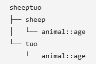
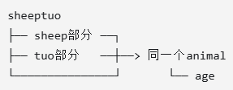
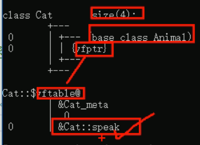
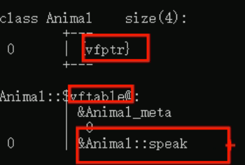
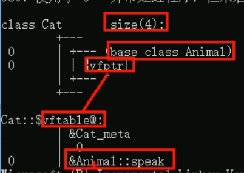

- [数据类型](#数据类型)
- [运算符](#运算符)
- [程序结构](#程序结构)
- [数组](#数组)
- [函数](#函数)
- [指针](#指针)
- [结构体](#结构体)
- [内存](#内存)
  - [new](#new)
- [引用(给变量起别名)](#引用给变量起别名)
- [函数高级](#函数高级)
  - [函数的默认参数](#函数的默认参数)
  - [函数的占位参数](#函数的占位参数)
  - [函数重载](#函数重载)
- [类\&对象](#类对象)
  - [封装](#封装)
  - [对象](#对象)
    - [构造函数与析构函数](#构造函数与析构函数)
    - [初始化列表:构造函数()：属性1(值1),属性2(值2)...{}](#初始化列表构造函数属性1值1属性2值2)
    - [类对象作为类成员](#类对象作为类成员)
    - [静态成员](#静态成员)
    - [成员函数和成员变量是分开存储的](#成员函数和成员变量是分开存储的)
    - [this指针(解决名称冲突/返回对象本身)](#this指针解决名称冲突返回对象本身)
    - [空指针调用成员函数](#空指针调用成员函数)
    - [const修饰成员函数](#const修饰成员函数)
  - [友元](#友元)
  - [运算符重载](#运算符重载)
    - [一：加号运算符重载](#一加号运算符重载)
    - [二：左移运算符重载](#二左移运算符重载)
    - [三：递增运算符重载](#三递增运算符重载)
    - [四：赋值运算符重载](#四赋值运算符重载)
    - [五：关系运算符重载](#五关系运算符重载)
    - [六：函数调用运算符重载(仿函数)](#六函数调用运算符重载仿函数)
  - [继承](#继承)
    - [一：继承基本语法](#一继承基本语法)
    - [二：继承方式](#二继承方式)
    - [三：继承中的对象模型](#三继承中的对象模型)
    - [四：构造和析构顺序](#四构造和析构顺序)
    - [五：同名成员处理](#五同名成员处理)
    - [六：同名静态成员处理](#六同名静态成员处理)
    - [七：多继承](#七多继承)
    - [八：菱形继承](#八菱形继承)
  - [多态](#多态)
    - [一：概念及语法](#一概念及语法)
    - [二：多态原理](#二多态原理)
    - [三：多态案列](#三多态案列)
    - [四：纯虚函数和抽象类](#四纯虚函数和抽象类)
    - [五：虚析构和纯虚析构](#五虚析构和纯虚析构)
- [文件操作](#文件操作)
  - [文本文件](#文本文件)
    - [一：写文件](#一写文件)
    - [二：读文件](#二读文件)
  - [二进制文件](#二进制文件)
    - [一：写文件](#一写文件-1)
    - [二：读文件](#二读文件-1)
- [职工管理系统](#职工管理系统)
  - [一：add()](#一add)
  - [二：save()](#二save)
  - [三：get\_num()](#三get_num)
  - [四：show()](#四show)
  - [五：dele()](#五dele)
  - [六：modify()  **重要**](#六modify--重要)
  - [七：search()](#七search)
  - [八：sort()](#八sort)
  - [九：clear()](#九clear)
  - [十：构造函数](#十构造函数)
  - [十一：析构函数](#十一析构函数)
  - [十二：Worker类](#十二worker类)
  - [十三：workerManner](#十三workermanner)
  - [十四：补充](#十四补充)
- [模板](#模板)
  - [函数模版](#函数模版)
    - [一：基本语法](#一基本语法)
    - [二：普通函数与模版函数区别](#二普通函数与模版函数区别)
    - [三：普通函数与模版的调用规则](#三普通函数与模版的调用规则)
    - [四：模板局限性](#四模板局限性)
  - [类模板](#类模板)
    - [一：基本语法](#一基本语法-1)
    - [二：类模板对象做函数参数](#二类模板对象做函数参数)
    - [三：类模板与继承](#三类模板与继承)
    - [四：类模板成员函数类外实现](#四类模板成员函数类外实现)
    - [五：类模板分文件编写](#五类模板分文件编写)
    - [六：类模板与友元](#六类模板与友元)
  - [案例](#案例)
- [STL](#stl)
  - [vector](#vector)
    - [一：基本语法](#一基本语法-2)
    - [二：容器中存放自定义数据类型](#二容器中存放自定义数据类型)
    - [三：vector容器中嵌套vector容器](#三vector容器中嵌套vector容器)
  - [string](#string)
    - [一：string构造函数](#一string构造函数)
    - [二：string赋值操作](#二string赋值操作)
    - [三：string字符串拼接](#三string字符串拼接)
    - [四：string查找与替换](#四string查找与替换)
    - [五：string字符串比较](#五string字符串比较)
    - [六：string字符串存取](#六string字符串存取)
    - [七：string字符串插入和删除](#七string字符串插入和删除)
    - [八：子串获取](#八子串获取)


```text
生成目录 ctrl+shift+p Markdown: Create Table of Contents
更新目录 自动更新 或手动更新 ctrl+shift+p Markdown: Update Table of Contents
```

## 数据类型
内存占用
```cpp
short 2字节
int   4字节
long  win为4字节 linux为4字节(32位)和8字节(64位)
long long   8字节
float 4字节
double 8字节
char 1字节
```
sizeof()
```cpp
int a = 10;
cout << sizof(short) <<endl;
cout << sizeof(a) << endl;
```
定义
```cpp
float c = 1.11;//默认为double，此操作将c转为float
float d = 1.11f;

//科学计数法
float f1 = 3e2;//3*10^2
float f2 = 3e-3;//3*10^-3

char ch = 'a';//只能有一个字符，且只能用单引号
//字符型变量char 并不是把字符本身放到内存中存储，而是将对应的ASCII编码放入到存储单元 a-97 A-65
int ass = int(ch);//97

//字符串
char str[] = "hello";
//或
#include <string>
string str1 = "hello";

//布尔
bool flag = true;
//打印输出为1
cout <<flag << endl;
```
数据输入
```cpp
int a = 0;
cin >> a;
//输入bool型时，只接受数字，不接收true/false  
```
\n换行 \t水平制表 \\转义

## 运算符
前置++
```cpp
//先+1，后运算表达式
int a = 10;
int b = ++a;
cout << b << endl;//b = 11
```
后置++
```cpp
//先进行表达式运算，后+1
int a = 10;
int b = a++;
cout << b << endl;//b = 10
```

## 程序结构
 if
 ```cpp
if(a>b){
    cout << a;
}
 ```
 三目运算符
 ```cpp
int a = 10;
int b = 20;
int c = 0;
c = a>b ? a:b;
//a>b成立则c=a a>b不成立则c=b
 ```
 switch
 ```cpp
switch(){
    case 1:a++;break;
    case 2:a--;break;
    default:a=b;break;
}
//不加break的话，倘若case为2，会运行a-- 和 a=b。
//switch相比if 执行效率高
 ``` 
 while和do_while
```cpp
int num = 0; 
//do_while先执行一次循环语句再判断循环条件 且dowhile的while后要加一个;
do{
    cout << num << endl;
    num++;
}while(num<10);
//while
while(num<10){
    cout << num << endl;
    num++;
}
```
水仙花数
```cpp
# 1^3+5^3+3^3=153
#include <iostream>
using namespace std;

int main(){
    int a =100;
    do{
        int bai = a/100;
        int shi = a%100/10;// a/10%10
        int ge = a&10;
        if(bai*bai*bai+shi*shi*shi+ge*ge*ge == a){
            cout << a << endl;
        }
        a++;
    }while(a<1000);
}
```
for
```cpp
for(int i = 0;i<100;i++){
    
}
```
9x9
```cpp
for(int i = 1 ;i<10;i++){
    for(int j = 1;j<=i;j++){
        //cout <<i "*" j = i*j >> endl;
        cout <<i << " * " << j << " = " << i*j << endl;
    }
    cout << endl;
}
```
break 直接结束此层循环
```cpp
for (int i=0;i<100;i++){
    if(i=10){
        break;
    }
}
```
continue 跳过此次循环的剩余代码，进入下一轮循环
```cpp
for(int i=0;i<10;i++){
    for(int j=0;j<10;j++){
        if(j=5){
            continue;
        }
        cout <<i << endl;
    }
}
```
goto
```cpp
cout << "1"<< endl;
cout << "2"<< endl;
goto FLAG;
cout << "3"<< endl;
cout << "4"<< endl;
FLAG:
cout << "5"<< endl;
```
## 数组
定义
```cpp
int arr1[];
int arr2[10]={};
int arr3[]={1,2,3,4,5};
```
sizeof
```cpp
sizeof(arr1);//统计整个数组在内存中的长度
sizeof(arr1[0]);//首个元素的内存占用长度
sizeof(arr1)/sizeof(arr1[0]);//二者结合可知数组长度
cout<<arr1 << endl;//打印出数组的首地址
```
元素逆置
```cpp
//法一
int arr1[5] = {1,2,3,4,5};
int end = sizeof(arr1)/sizeof(arr1[0]);
int num1;
for(int i=0;i<(end/2);i++){
    num1 = arr1[i];
    arr1[i]=arr1[end-1-i];
    arr1[end-1-i]=num1;
}
for(int i=0;i<=(end-1);i++){
    cout<< arr1[i] << endl;
}

//法二
int arr2[5]={1,2,3,4,5}
int end2 = sizeof(arr1)/sizeof(arr1[0]);
int num2;
for(int i =0;i<end2;i++){
    num2 = arr2[i];
    arr2[i] = arr2[end2-1];
    arr2[end2-1] = num2;
    end2--;
}
for(int i=0;i<=(end2-1);i++){
    cout<< arr2[i] << endl;
}

//法三
int arr3[5] = {1,2,3,4,5};
int end3 = sizeof(arr3)/sizeof(arr3[0]) - 1;
int num3;
int len = sizeof(arr1)/sizeof(arr1[0]);
int start3 = 0;
while(start3<end3){
    num3 = arr3[start3];
    arr3[start3] = arr3[end3];
    arr3[end3] = num3;
    end3--;
    start3++;
}
for(int i=0;i<len;i++){
    cout << arr3[i];
}
```
冒泡排序


```text
排序总轮数 = 元素个数 - 1
每轮对比次数 = 元素个数 - 排序轮数 - 1
```
```cpp
int arr0[] = {5,0,6,3,7,1,8,9};
len = sizeof(arr0)/sizeof(arr0[0]);
int max;
for(int i=0;i<len-1;i++){
    for(int j=0;j<len-i-1;j++){
        if (arr0[j]>arr0[j+1]){
            max = arr0[j];
            arr0[j] = arr0[j+1];
            arr0[j+1] = max;
        }
    }
}
for(int i=0;i<len;i++){
    cout << arro[i];
}
```
二维数组
```cpp
 int arr[2][3] = {{1,2,3},{4,5,6}};//{1,2,3,4,5,6}也可以
 int arr1[][3] = {1,2,3,4,5,6,7,8,9};//行数可以省略，列数不可以省略
//遍历
for(int i=0;i<2;i++){ 
    for(int j=0;j<3;j++){
        cout << arr[i][j] << endl;
    }
}   
//取某个元素的首地址时需要加取址符 & 
cout << (int)&arr[0][0] << endl;
```
## 函数
程序从上往下读，如果函数定义在调用之后，那么需要提前声明
```cpp
#include <iostream>
using namespace std;

int max();

int main(){
    return 0;
}
int max(){
    return 0;
}
```
分文件编写函数
```text
建一个.h文件用于写声明
建一个cpp文件用于写定义  顶部引用头文件#include "swap.h"
```
## 指针
定义
```cpp
int a = 10;
int * p = &a; //32位win占4字节   64位win占8字节 不管是什么数据类型(int/float/double)
cout << p << " " << &a << endl;
```
解引用 *p -> p指向的数值
```cpp
int a = 100;
int * p = &a;
*p = 1000;
cout << a <<" " << *p << endl; 
```
空指针
```text
初始化指针变量
且空指针指向的内存无法访问
内存编号0~255为系统占用内存，不允许用户访问
```
```cpp
int *p = NULL;
```
野指针
```text
指针变量指向非法的内存空间，访问会出错
```
const
```cpp
//常量指针(修饰指针)  指针的指向可以更改，但指针指向的值不可更改
int a = 10;
int b = 20;
const int *p = &a;
p = &b;
//*p = 30;错误

//指针常量(修饰常量) 指针指向不可改，指向的值可以改
int a = 10;
int b = 20;
int * const p = &a;
*p = 30;
//p = &b;错误

//const既修饰指针也修饰常量   两个都不可以改
int a = 10;
int b = 20;
const int * const p = &a;
//p = &b;错误
//*p = 30;错误
```
指针访问数组元素
```cpp
int arr[10] = {1,2,3,4,5,6,7,8,9,10};
int *p = arr;
cout << "第一个元素为：" << arr[0] << endl;//1
cout << "利用指针访问第一个元素" << *p << endl;//1
p++;//让指针向后偏移四个字节(智能识别步长，若为char *p 则p++代表偏移一个字节)
cout << "利用指针访问第二个元素：" << *p << endl;//2
```  
指针遍历数组
```cpp
int arr[10] = {1,2,3,4,5,6,7,8,9,10};
int *p = arr;
for(int i = 0;i<10;i++){
    cout << *p << endl;
    p++;
}
```
指针和函数
```cpp
//值传递不会改变实参数据
//地址传递可以实现改变实参数据
void swap(int *p1,int *p2){
    int temp = *p1;
    *p1 = *p2; 
    *p2 = temp;
    cout << *p1 << *p2 << endl;// 20 10
}
int main(){
    int a = 10;
    int b = 20;
    swap(&a,&b);
    cout << a << b << endl;//20 10
}
```
## 结构体
定义
```cpp
#include <iostream>
using namespace std;
#include <string> //cout << name

struct Student{
    string name;
    int age;
    int score;
}; // ;不要漏

int main(){
    struct Student s1;//创建结构体对象时，struct可以省略，即Student s1
    s1.name = "mike";
    s1.age = 11;
    s1.score = 100;
    cout << "name" << s1.name << "age" << s1.age << "score" << s1.score;
    
    struct Student s2 = {"jack",12,200};

} 
``
结构体数组
```cpp
struct Student{
    string name;
    int age;
    int score;
};

int main(){
    struct Student stuArray[]={
        {"mike",10,200},
        {"jack",21,130},
        {"lucy",30,90}
    };
    stuArray[2].name = "niko";

}
```
结构体指针
```cpp
struct Student{
    string name;
    int age;
    int score;
};

int main(){
    Student s = {"mike",11,100};
    Student *p = &s;//s是student型变量
    cout << p->name 
}
```
结构体嵌套结构体
```cpp
#include <iostream>
using namespace std;
#include <string> //cout << name

struct Student{
    int score;
    int age;
    string name;
};
struct Teacher{
    string name;
    int age;
    int id;
    Student stu;
};

int main(){
    Teacher t;
    t.id = 1001;
    t.age = 20;
    t.name = "mike";
    t.stu.name = "jack";
    t.stu.age = 10;
    t.stu.score = 100;
    cout << "teacher name:" << t.name << ", age:" << t.age << ", id:" << t.id << endl;
    cout << "stu.name:" << t.stu.name << ", stu.age:" << t.stu.age << ", stu.score:" << t.stu.score << endl;
}
```
结构体作为参数
```cpp
//值传递
void test1(struct student s){
    cout << s.name;
}

//地址传递
void test2(struct student *p){
    cout << p->name;
}

int main(){
    Student s1 = {"mike",11,200};
    test1(s1);
    test2(&s1);
}
```
const应用于结构体(常量指针)
```cpp
void test1(const Student *s){
      
}
//用常量指针每次只传递一个指针，仅4字节，而值传递则会复制整个结构体的数据过去。相比之下速度更快且能防止栈溢出
//相比于指针，常量指针不会改变实参的值
```
随机数
```cpp
#include <ctime>

srand((unsigned int)time(NULL));
int random = rand()%61+40//rand()%61 表0到60的随机数
```
## 内存
cpp程序运行时内存分区
```text
代码区 : 存放函数体的二进制代码  (共享 只读)   
全局区 : 存放全局变量、静态变量、常量
栈区 : 由编译器自动分配释放，存放函数的参数值，局部变量等 (不要返回局部变量的地址)
堆区 : 由程序员分配释放，若程序员不操作，程序结束时由操作系统回收
```
不要返回局部变量的地址
```cpp
int * func(){
    int a = 10;
    return &a;
}
int main(){
    int *p = func();
    cout << *p << endl;//第一次可以打印出正确的数字10
    cout << *p << endl;//第二次数据不再保留
}
```
利用new关键字，可以将数据开辟到堆区->可以返回局部变量的地址
```cpp
int * func(){
    int *p = new int(10);
    //new会返回开辟出的内存的地址(即返回new的类型的指针)，10代表将此数据赋初值
    return p; 
}
int main(){
    int *p = func();
    cout  << *p << endl;
    cout  << *p << endl;//均能成功返回数据10

}
```
### new
new的基本语法(new什么数据，就会返回个什么类型的指针)
```cpp
int * func(){
    int *p = new int(10);
    return p; 
}
void test1(){
    int *p = func();
    cout  << *p << endl;
    cout  << *p << endl;
    //堆区的数据由程序员管理开辟，程序员管理释放
    //释放堆区数据用delete
    delete p;
    cout  << *p << endl;//报错，内存已释放，无法访问
}
void test2(){
    //在堆区中new开辟数组
    new int[10];//10代表有10个元素，(10)代表赋初值10
    for(int i=0;i<10;i++){
        arr[i] = i+100;
    }
    for(int i=0;i<10;i++){
       cout << arr[i] <<endl;//可正常输出
    } 
    //释放堆区数组的内存,加上中括号
    delete[] arr;
    for(int i=0;i<10;i++){
       cout << arr[i] <<endl;//内存已释放，无法访问
    }

}
int main(){
    test1();
    test2();
}
```
## 引用(给变量起别名)
数据类型 &别名 = 原名
```cpp
int &b = a;
b = 20;
cout << a << endl;//输出20
//a，b操纵的是同一片内存
```
注意事项
```cpp
//引用必须要初始化
int &b;//错误示范
int &b = a;

//引用一旦初始化便不可更改
int a = 10;
int &b = a;
int c = 20;
&b = c;//错误示范
b = c;//仅赋值操作而非更改引用
```
引用做函数参数
```cpp
//形参修饰实参有两种方法，一种是地址传递，一种是引用传递
void swap1(int &a,int &b){//与swap1(int *a,int *b) 做区分
    //此处的ab是实参ab的别名，实际上就是指向实参ab的地址
    int temp = a;
    a = b;
    b = temp;    
}
int  main(){
    int a = 10;
    int b = 20;
    swap1(a,b);
    cout << a << endl;
    cout << b << endl；//成功交换
}
```
引用做函数返回值
```cpp
//不要返回局部变量的引用(和不要返回局部变量的地址原理一样，即函数运行完就释放局部变量的内存)
int& test1(){
    int a = 10;
    return a;
}  
int& test2(){
    static int a = 10;//静态变量，存在全局区，全局区上的数据等程序结束后再释放
    return a;
}
int main(){
    a1 = test1();
    cout << a1 << endl;//10
    cout << a1 << endl;//无结果
    a2 = test2();
    cout << a2 << endl;//20
    cout << a2 << endl;//20
    //函数的调用可以作为左值
    a3 = test2() = 1000;
    cout << a3 << endl;//1000
    cout << a3 << endl;//1000
} 
```
引用本质 相当于一个常量指针
```cpp
    int a =10;
    
    int * const ref = &a;
    等价
    int& ref = a;
```
const修饰引用--防止误操作
```cpp
void  showValue(int &val){
    val = 1000;
    cout << val << ednl;
}
void showValue1(const int &val){//加上const 对val的修改操作便是违法行为
    cout <<  val << ednl;
}
int main(){
    int a = 100;
    showValue(a);//函数内修改val，指向同一片内存，a也被修改为1000
    showValue1(a);
    cout<< a<< endl;
}
```
```cpp
int main(){
    int& ref = 10;//编译错误
    const int& ref = 10;//编译器优化代码，int temp = 10;  const  int& ref = temp;
}
```
## 函数高级
### 函数的默认参数
默认参数必须放在最后。如果自己传入数据，那么就用自己的数据，如果没有传入数据，那么就用默认值。
```cpp
如 int func(int a,int b = 1,int c){} //错误
   int func(int a ,in b = 1, int c = 2){} //正确
```
```cpp
int sum(int a,int b,int c=1){
    return a+b+c;
}
int main(){
    int a = 1;
    int b = 2;
    int c = 3;
    sum = sum(a,b,c);  //结果为6
    sum1 = sum(a,b);  //结果为4
}
``` 
如果函数声明有默认参数，函数实现就不能有默认参数(二选一)
```cpp
int func(int a=10,int b=20);
int func(int a=10,int b=20){//报错，重新定义了默认参数
    return a+b;
}
```
### 函数的占位参数
占位了必须传对应的数据，但传过来的数据暂时用不到
```cpp
void func(int a,int){
    pass;
}
int main(){
    func(10,20);
}
```
占位参数可以有默认参数
```cpp
void func(int a,int = 20){
    pass;
}
int main(){
    func(10);
}
```
### 函数重载
函数名可以相同，以提高复用性
```text
条件 均要满足
一:同一个作用域下
二:函数名称相同
三:函数参数类型不同，或个数不同，或顺序不同
```
```cpp
void func(){
    cout << "1" << endl;
}
void func(int a){
    cout << "2" << endl;
}
int main(){
    func();
    func(1);
}
```
函数的返回值不可以作为函数重载的条件
```cpp
//错误示范
void func(){
    cout << "1" << endl;
}
int func(){//仅返回值不同不满足条件
    cout << "2" << endl;
}
int main(){
    func();//1
    func(1);//2
}
```
引用作为重载的条件
```cpp
void func(int &a){
    cout << "1" << endl;
}
void func(const int &a){
    cout << "2" << endl;
}
int main(){
    int a =10;
    func(a);//a是变量,打印1
    func(10);//打印2
}
```
函数重载遇到默认参数
```cpp
void func(int a,int b=10){
     cout << "1" << endl;
}
void func(int a){
    cout << "2" << endl;
}
int main(){
    func(10);//这样调用错误，两个func都能调用
    //故避免这种情况发生
    func(10,20);//可成功调用，意味着第二个func()调用不了
}
```
## 类&对象
### 封装
属性和行为作为整体，即变量和函数
```text
类中的属性和行为，统一称为成员
属性：成员属性/成员变量
行为：成员函数/成员方法
```
```cpp
class Circle {

public:

    int m_r;
    
    double calculate1() {
        return 2 * (3.14) * m_r;
    }
};

int main() {
    Circle c1;
    c1.m_r = 10;
    cout << "周长" << c1.calculate1() << endl;
}
```
```cpp
class student {

public:
    string name;
    int id;

    void set() {
        cin >> name;//cin << this->name
        cin >> id;//cin << this->id
    }
    string printname() {
        return name;
    }
    int printid() {
        return id;
    }

};


int main() {
    student s1;
    s1.set();
    cout << s1.printid() << endl;
    cout << s1.printname() << endl;
}
```
访问权限
```text
public 公共--成员 类内可以访问，类外也可以访问
private 私有--成员 类内可以访问，类外不可以访问(子类不可以访问父类中的private内容)
protected 保护--成员 类内可以访问，类外不可以访问(子类可以访问父类中的protected内容)

私有成员通常由构造函数初始化，再通过公共成员函数读取或修改
```
class与struct区别
```text
默认的访问权限不同

struct中默认为public
class 中默认为private
```
在开发中，一般将成员属性设为私有，而成员函数设为公有
```text
优点1：将所有成员属性设为私有，可以自己控制读写权限(自己设置读写的接口)
优点2：对于写权限，可以检测数据的有效性
```
```cpp
class student {

private:
    string my_name;
    int my_id = 10;

public:
    void setname(string name) {
        my_name = name;
    }
    string printname() {
        return my_name;
    }
    int printid() {
        return my_id;
    }

};


int main() {
    student s1;
    s1.setname("mike");//用了公有的写接口
    //s1.my_id = 30;//报错，无法访问私有变量，即只读不写
    //cout << s1.my_id << endl;//没用公有的读接口，无法访问
    cout << s1.printname() << endl;//用了公有的读接口
    cout << s1.printid() << endl;//用了公有的读接口
}
```
封装案例

 [package_test.cpp 源码](./package_test.cpp)

 [package_test1.cpp 源码](./package_test1.cpp)

 ### 对象
 #### 构造函数与析构函数
    构造函数
 ```text
类名(){}
没有返回值也不写void
函数名称与类名相同
构造函数可以有参数因此可以发生重载
程序在调用对象时会自动调用构造，无需手动调用，且只会调用一次
 ```
    析构函数
 ```text
~类名(){}
没有返回值也不写void
函数名称与类名相同，在名称前加上~
析构函数无参数，因此不可以重载
程序在对象销毁前会自动调用析构，无需手动调用，且只会调用一次 
```
```cpp
#include <iostream>
using namespace std;
#include <string>

class Person {
public:
    Person() {
        cout << "构造函数调用" << endl;
    }
    ~Person() {
        cout << "析构函数调用" << endl;
    }
};
int main() {
    Person p;//自动调用构造和析构函数
    //如果自己不提供，那么编译器会提供一个空实现的构造和析构函数
    //对象被销毁才会运行析构函数
    system("pause");
    return 0;
}
```
    构造函数的分类
```text
按参数分类：有参构造和无参构造
按类型分类：普通构造和拷贝构造
```
    三种调用方式
```texts
括号法
显示法
隐式转换法
```
```cpp
#include <iostream>
using namespace std;
#include <string>

class Person {
public:
    //构造函数
    Person() {
        cout << "无参(默认)构造函数" << endl;
    }
    Person(int a) {
        age = a;
        cout << "有参构造函数" << endl;
    }

    Person(const Person& p) {//const保证不修改原对象，且以引用的方式传递
        age = p.age;//将传入的对象的所有属性拷贝到自己身上
        cout << "拷贝构造函数" << endl;
    }
    ~Person() {
        cout << "析构函数" << age << endl;
    }
private:
    int age;
};


int main() {
    //括号法
    Person p1;//不要写成Person p1(); 会被视作一个函数声明
    Person p2(10);
    Person p3(p2);//p3拷贝p2的数据
    //创建p1——创建p2——创建p3——销毁p3——销毁p2——销毁p1，至于这个p1销毁时age=1则是由于无参，所以给的一个随机值

    //显式法
    Person p1;
    Person p2 = Person(10);
    Person p3 = Person(p2);
    //Person(10)、Person(p2)为匿名对象 
    //特点:当系统前行执行结束后，系统会立刻回收匿名对象
    Person(10);
    cout << "aa" << endl;
    //不要利用拷贝函数初始化匿名对象 如Person(p3) 等价于  Person(p3) == Person p3;

    //隐式转换法
    Person p4 = 10;//相当于Person p4 = Person(10) 有参构造
    Person p5 = p2;//同理
}

```
    拷贝构造函数调用时机
```text
使用一个已经创建完毕的对象来初始化一个新的对象
值传递的方式给函数参数传值
以值方式返回局部对象
```
    构造函数调用规则
```text
创建一个类，编译器自动生成三个函数(默认构造函数/析构函数/拷贝构造函数)
若用户自定义有参构造函数，c++不再提供默认无参构造函数，但会提供默认拷贝构造
若用户自定义拷贝构造函数，c++不再提供其他构造函数
```
    深拷贝和浅拷贝(面试常问)
```text
浅拷贝：简单的赋值拷贝操作(复制地址)
深拷贝：在堆区重新申请空间，进行拷贝操作(复制地址指向的数据，并创建新的内存)
```

```cpp
//自动生成拷贝函数
#include <iostream>
using namespace std;
#include <string>

class Person{
public:
    Person(int age,int height) {    
        m_age = age;
        m_height = new int(height);//new会返回开辟出内存的地址，即指定类型的指针，将数据开辟到堆区
        //析构函数主要作用：将堆区的数据进行释放
        cout << "有参构造函数" << endl;
    }
    ~Person(){
        if(m_height != NULL){
            delete m_height;
            m_height =  NULL;
        }
        cout << "析构函数调用" <<endl;
    }
    int m_age;
    int *m_height;
};
int main(){
    Person p1(18,160);
    Person p2(p1);//此处是拷贝重点
    cout<<p2.m_age<<endl;
    cout<<*p2.m_height<<endl;
}
//对于m_age,利用编译器提供的拷贝函数，会做浅拷贝操作，利用默认的拷贝构造函数，复制了地址m_height
//对于*m_height，仍然是浅拷贝操作，浅拷贝操作对于指针变量会有影响。更改p1.height，p2.height也会随之更改。还有重复释放的问题。
```
```text
浅拷贝会带来问题：堆区重复释放(相互影响)
解决:利用深拷贝解决(重新申请内存)
```
```cpp
class Person{
public:
    Person(int age,int height) {
        m_age = age;
        m_height = new int(height);
        cout << "有参构造函数" << endl;
    }
    ~Person(){
        if(m_height != NULL){
            delete m_height;
            m_height =  NULL;
        }
        cout << "析构函数调用" <<endl;
    }
    Person(const Person &p){//自定义拷贝构造函数，new一个地址给p2.m_height
        cout << "拷贝函数调用" << endl;
        m_age = p.m_age;
        //m_height = p.m_height;浅拷贝操作(复制地址，共享一个整数)
        //m_height = p.m_height;编译器默认实现此行代码
        //深拷贝操作，解决浅拷贝带来的问题
        m_height = new int(*p.m_height);//深拷贝操作(复制整数，新建独立内存)
    }
    int m_age;
    int *m_height;
};  
```
#### 初始化列表:构造函数()：属性1(值1),属性2(值2)...{}
```cpp
class Person{
public:
    //传统的创建对象时就赋初值
    //Person(int a,int b,int c){
    //    m_a = a;
    //    m_b = b;
    //    m_c = c;
    //}

    //初始化列表赋初值
    Person() :m_a(10),m_b(20),m_c(30){
        
    }

    //改进版初始化列表赋值
    Person(int a,int b,int c):m_a(a),m_b(b),m_c(c){
        
    }

//private:
    int m_a;
    int m_b;
    int m_c;
};
void test1(){
    //Person p(10,20,30);

    //Person p;
    
    Person p(30,20,10);
    
    cout << p.m_a<<endl;
    cout << p.m_b<<endl;
    cout << p.m_c<<endl;
}

int main(){
   test1();
}
```
#### 类对象作为类成员
```cpp
//先构造内部的类对象，即先构造phone对象，后构造person对象
//栈——>先进后出。先释放person对象，在释放phone对象
class phone{
public:
    phone(string pname){
        m_name = pname;
        cout << "phone构造函数" << endl;
    }
    ~phone(){
        cout<<"phone析构函数"<<endl;
    }

    string m_name;
};

class Person{
public:
    Person(string name,string pname):m_name(name),m_phone(pname){//m_phone(pname)等价于phone m_phone = pname,即初始化phone对象的m_name为pname
        cout << "person构造函数" << endl;
    }
    ~Person(){
        cout<<"person析构函数"<<endl;
    }

    string m_name;
    phone m_phone;
};

void test1(){
    Person p("mike","iphone");
    cout << p.m_name << "+" << p.m_phone.m_name << endl;
}
int main(){
    test1();
}
```
#### 静态成员
```text
静态成员变量
    所有对象共享同一份数据
    在编译阶段分配内存
    类内声明，类外初始化
    不属于某个对象,属于类，有两种访问方式(1:通过对象进行访问  2：通过类名进行访问)
静态成员函数
    所有对象共享同一个函数
    静态成员函数只能访问静态成员变量
        (类外调用私有静态变量一般用公共静态函数，因为静态变量不属于任何对象，若使用普通函数，还需要建立对象访问函数。)
```
```cpp
class person{
public: 
    int m_c;
    //类内声明，类外初始化
    static int m_a;

    static void func(){
        cout<<"静态函数调用"<<endl;
        m_a = 10;
        m_b = 20;
        //m_c = 30;静态函数无法访问非静态变量，因为要建立特定对象访问非静态变量
    }
private:
    static int m_b;//仅是声明
};

int person::m_a = 100;
int person::m_b = 200;//定义并赋初值，private运行静态成员在类外定义

void test1(){
    person p;
    cout << p.m_a<<endl;
    person p1;
    p1.m_a = 23;
    cout << p.m_a<<endl;
}

void test2(){
    person p2;
    cout << p2.m_a << endl;//通过对象访问静态变量
    cout << person::m_a << endl;//通过类名访问静态变量 ** 推荐
    //cout << person::m_b << endl;类外无法直接访问私有成员变量
}

void test3(){
    person p3;
    p3.func();//通过对象调用
    person::func();//通过类名调用 ** 推荐
}

int main(){
    test1();
    test2();
    test3();
}
```
#### 成员函数和成员变量是分开存储的
```cpp
class Person{

};

class student{
    int m_a;//***非静态成员变量，属于类的对象上
    static int m_b;//静态成员变量，不属于类的对象上
    void func(){}//非静态成员函数，也不属于类的对象上
    static void func1(){}//静态成员函数，也不属于类的对象上
};

void test1(){
    Person p;//***空对象占用内存空间为1，c++编译器会给空对象也分配一个字节的空间，目的是为了区分空对象占内存的位置
    cout << "sizeof(p)=" << sizeof(p) << endl;//1字节
    student s;
    cout << "sizeof(s)=" << sizeof(s) << endl;//4字节,静态变量不属于类的对象上
}

int main(){
    test1();
}
```
#### this指针(解决名称冲突/返回对象本身)
```cpp
//错误示范
class person{
public:
    person(int age){
        age = age;//此处三个age由于重名，被视作为一个age变量
    }
    int age;
};

void test1(){
    person p1(18);
    cout << p1.age << endl;//乱码
}

int main(){
    test1();
}
```
```cpp
//解决办法(m_age/this->age)   解决名称冲突
class person{
public:
    person(int age){
        this->age = age;//this指向的是被调用的成员函数所属的对象，this->age指此类的成员变量age而非形参
    }
    int age;
};

void test1(){
    person p1(18);
    cout << p1.age << endl;
}

int main(){
    test1();
}
```
```cpp
//*this实现返回对象本身
class person{
public:
    person(int age){
        this->age = age;//this指向的是被调用的成员函数所属的对象，this.age指此类的成员变量age而非形参
    }
    int age;
    person& personaddage(person &p){//注意返回值类型是person&,如果写成了person，返回的只是p4的一个副本，后面做的两次都只是基于副本加1，并未改变原变量实际值
    //person  personaddage(...) // 返回副本(值)
    //person& personaddage(...) // 返回原对象(引用)
        this->age += p.age;
        return *this;
    }
};

void test2(){
    person p2(20);
    person p3(40);
    person p4(10);
    person p5(1);
    cout << p3.age << endl;
    p3.personaddage(p2);
    cout << p3.age << endl;
    cout << p4.age << endl;
    p4.personaddage(p5).personaddage(p5).personaddage(p5);//链式编程
    cout << p4.age << endl;
}

int main(){
    test2();
}

```
#### 空指针调用成员函数
```text
空指针可以访问成员函数
但涉及到this时，会报错
```
```text
空指针调用非静态成员函数属于未定义行为，不允许这样使用。

show1() 没有访问对象的数据，在某些编译器和运行环境中可能碰巧正常输出，
但这不代表写法正确。

showage() 中的 age 等价于 this->age。
由于 p 是空指针，调用时 this 也是空指针，不存在一个真实的 person 对象，
因此无法读取该对象的 age，通常会导致程序崩溃。

if (this == nullptr) 虽然在某些情况下看起来能阻止访问，
但不能让空指针调用成员函数变成合法行为。
正确做法是在调用成员函数之前检查 p。
```
```cpp
class person{
public:
    void show1(){
        cout<<"1"<<endl;
    }
    void showage(){
        if(this == nullptr){
            return;//报错原因是因为指针为nullptr，而age属于对象
        }
        cout << age << endl;//age等价于this->age
    }
    int age=10;
};

void test(){
   person *p = nullptr;
   p->show1();
   p->showage();
}

int main(){
    test();
}
//对于空指针，尽量用nullptr。如func(NULL)可能匹配int，而func(nullptr)明确匹配int*
```
#### const修饰成员函数
```text
常函数
    成员函数加const后称之为常函数
    常含数不可以修改成员属性
    成员属性声明时加关键字mutable后，在常函数中依然可以修改
常对象
    声明对象前加const成为常对象
    常对象只能调用常函数
```
```cpp
class person{
public:
    void showperson()const{
        //m_a = 10;等价this->m_a=10;
        //常函数中的this相当于const *person const this(第一个const：不能通过this修改他所指对象的普通成员。第二个const：this自身不能改为指向另一个对象)，不能通过this修改普通成员变量
        this->m_b = 100;//定义时加mutable即可修改
        cout<<"1"<<endl;
    }
    void func(){

    }
    int m_a=0;
    mutable int m_b=0;
};
void test1(){
    person p;
    p.func();
    p.showperson();
}
//常对象
void test2(){
    const person p1;
    //p1.m_a = 200;常对象不能修改普通的成员变量
    p1.m_b = 200;//定义时加mutable即可修改
    
    p1.showperson();
    //p1.func();常对象只能调用常函数
}
int main(){
    test1();
    test2();
}
```
### 友元
关键字friend<br>
友元关系不继承、不传递
```text
全局函数做友元       friend void test1(Building *building);
类做友元             friend class goodfriend;
成员函数做友元       friend void goodfriend::visit();
```
全局函数做友元
```cpp
class Building{

    friend void test1(Building *building);
    //test1是Building的友元，可以访问Building的私有成员

public:
    string m_sittingroom;
    Building(){
        m_sittingroom = "客厅";
        m_bedroom = "卧室";
    }
private:
    string m_bedroom;
};


void test1(Building *building){
    cout<<"friend正在访问:" << building->m_sittingroom<<endl;
    cout<<"friend正在访问:" << building->m_bedroom<<endl;
}


void test2(){
    Building building;
    test1(&building);
}
int main(){
    test2();
}
```
类作友元
```cpp
class Building;

class goodfriend{
public:
    goodfriend();
    void visit();
    Building * building;//声明指针，并没有创建对象
    ~goodfriend(){//必须释放否则内存泄漏
        delete building;
    }
};

class Building{
    friend class goodfriend;
    //goodfriend是Building的friend
public:
    Building();
    string m_sittingroom;

private:
    string m_bedroom;
};
//类外写成员函数
Building::Building(){
    m_sittingroom = "客厅";
    m_bedroom = "卧室";
}
goodfriend::goodfriend(){
    //创建building对象
    building = new Building;
}

void goodfriend::visit(){
    cout << "friend正在访问" << building->m_sittingroom << endl;
    cout << "friend正在访问" << building->m_bedroom << endl;
}

void test1(){
    goodfriend g1;
    //创建一个goodfrined对象，而goodfriend类的构造方法中又创建了building对象，building类的构造方法中给building对象赋初值
    g1.visit();
}
int main(){
    test1();
}
```
成员函数作友元
```cpp
class Building;

class goodfriend{
public:
    goodfriend();
    void visit();//让visit可以访问Building中私有的成员
    void visit1();//让visit1不可以访问私有成员
    Building * building;
    ~goodfriend(){//释放堆区内存
        delete building;
    }
};

class Building{
    friend void goodfriend::visit();
public:
    Building();
    string m_sittingroom;

private:
    string m_bedroom;
};

//类外写成员函数
Building::Building(){
    m_sittingroom = "客厅";
    m_bedroom = "卧室";
}
goodfriend::goodfriend(){
    //创建building对象
    building = new Building;
}

void goodfriend::visit(){
    cout << "visit-friend正在访问" << building->m_sittingroom << endl;
    cout << "visit-friend正在访问" << building->m_bedroom << endl;
}
void goodfriend::visit1(){
    cout << "visit1-friend正在访问" << building->m_sittingroom << endl;
    //cout << "visit1-friend正在访问" << building->m_bedroom << endl;
}

void test1(){
    goodfriend g1;
    //创建一个goodfrined对象，而goodfriend类的构造方法中又创建了building对象，building类的构造方法中给building对象赋初值
    g1.visit();
    g1.visit1();
}
int main(){
    test1();
}
```
### 运算符重载
#### 一：加号运算符重载
```text
通过局部函数或者全局函数重载加号运算符
局部函数意思就是在类内定义一个函数，然后通过对象调用，如p1.test(p2)
全局函数是在类外定义一个函数，直接调用，如test(p1,p2)

运算符重载的意义:给运算符号一些新的定义，如person p3 = p1 + p2;
```
```cpp
class person {
public:
    int m_a;
    int m_b;
    person add1(person& p1) {//此处的p1为引用而非指针，指针是person *p1,故而后续引用数据采用p1.m_a而非p1->m_a
        person temp;
        temp.m_a = this->m_a + p1.m_a;
        temp.m_b = this->m_b + p1.m_b;
        return temp;
    }
};
person add2(person& p1, person& p2) {
    person temp;
    temp.m_a = p2.m_a + p1.m_a;
    temp.m_b = p2.m_b + p1.m_b;
    return temp;
}
void test1() {
    person p1;
    p1.m_a = 10;
    p1.m_b = 1;
    person p2;
    p2.m_a = 20;
    p2.m_b = 2;
    person p3;
    person p4;
    p3 = p1.add1(p2);
    p4 = add2(p1, p2);
    cout << p3.m_a << " " << p3.m_b << endl;
    cout << p4.m_a << " " << p4.m_b << endl;
}
int main() {
    test1();
    return 0;
}
```
改进版，用系统自带(operator+())
```cpp
//将重载的函数名改为
person operator+(person &p1){}
person operator+(person &p1,person &p2){}
//这样就可直接写
person p3 = p1 + p2;//本质是p3 = operator+(p1,p2)/p3 = p1.operator(p2)

//改成
person operator+(person &p1,num)
//即可实现
p3 = p1 + num;
```
示例
```cpp
//成员函数版本
class Person {
public:
    Person(int a, int b) : m_a(a), m_b(b) {}

    Person operator+(const Person& other) const {
        Person temp;

        temp.m_a = m_a + other.m_a;
        temp.m_b = m_b + other.m_b;

        return temp;
    }

    Person() = default;

    int m_a = 0;
    int m_b = 0;
};
void test(){
    Person p1(10, 1);
    Person p2(20, 2);
    Person p3 = p1 + p2;//Person p3 = p1.operator+(p2);
    //p1 是调用函数的对象，也就是 *this,左侧的 p1 已经通过 this 传入。
    //p2 传给参数 other
}
```
```cpp
//全局函数版本
Person operator+(const Person& p1, const Person& p2) {
    Person temp;

    temp.m_a = p1.m_a + p2.m_a;
    temp.m_b = p1.m_b + p2.m_b;

    return temp;
}
void test(){
   Person p3 = p1 + p2;//Person p3 = operator+(p1, p2);
}
```
#### 二：左移运算符重载
一般采用全局函数进行重载，重载左移运算符可以实现输出自定义数据类型
```cpp
class person{
friend ostream & operator<<(ostream &out,person &p);//声明友元函数，以访问private成员变量
public:
        void set(int a,int b){
            m_a = a;
            m_b = b;
        }    
private:
        int m_a;
        int m_b;
};

ostream & operator<<(ostream &out,person &p){//简化operator<<(cout，p)即cout<<p
    //cout是输出流对象(ostream对象)，p是person类对象
    out << "m_a:" << p.m_a << "m_b:" << p.m_b << endl;
    return out;//返回值处加&表示返回的是输出流对象本身，而不是新建一个ostream对象
    //若返回值是void，则无法实现cout<<p1<<endl的连续输出
}

int main(){
    person p1;
    p1.set(10,20);
    cout << p1 << "hello" << endl; 
    //operator<<(cout,p1); 二者均可
}

```
#### 三：递增运算符重载
前置递增返回引用，后置递增返回值。(如果返回临时变量temp的引用，那返回的是+1后的新值，而不是旧值)
```text
固定写法
person &operator++(){}      前置递增
person operator++(int){}    后置递增
```
```cpp
class person{
friend ostream & operator<<(ostream &out,const person &p);//声明友元函数
public:
        person(){
            m_num = 0;
        }  
//重载前置++运算符
        person &operator++(){//重载前置++运算符
            //先++运算
            m_num++;
            //再将自身返回
            return *this;
        }
//重载后置++运算符
        person operator++(int){//此处的形参int代表占位参数，用于区分前置和后置递增
           person temp = *this;//先将当前对象的值(旧值)保存到临时对象中
           m_num++;//再将当前对象的值加1
           return temp;//返回临时对象
        }
private:
        int m_num;
        
};

ostream & operator<<(ostream &out,const person &p){//const person &p表示传入的person对象是只读的，不能修改其成员变量,且可以接收临时对象和普通对象
    //简化operator<<(cout，p)即cout<<p
    //cout是输出流对象(ostream对象)，p是person类对象
    out << "m_num:" << p.m_num << endl;
    return out;//返回值处加&表示返回的是输出流对象本身，而不是新建一个ostream对象
    //若返回值是void，则无法实现cout<<p1<<endl的连续输出
}
void test1(){
    person p1;
    cout << ++(++p1) << endl;
    cout << p1 << endl;
    //若person operator++()，则输出为一个2一个1，每次++运算都会返回一个新的person对象，p1的m_num值不会改变
    //若person &operator++()，则输出为一个2一个2，每次++运算都会返回自身的引用，p1的m_num值会改变
    
}
void test2(){
    person p2;
    cout << (p2++)++ << endl;
    cout << p2 << endl;
}
int main(){
    //test1();
    test2();

    return 0;
}
```
#### 四：赋值运算符重载
```text
cpp编译器给一个类至少添加4个函数
1默认构造函数(无参，函数体为空)
2默认析构函数(无参，函数体为空)
3默认拷贝构造函数，对属性进行值拷贝
4赋值运算符operator=，对属性进行值拷贝

若类中有属性指向堆区，做赋值操作时也会出现深浅拷贝问题，导致堆区内存重复释放
编译器默认提供的=是浅拷贝操作，所以需要重载=，加入深拷贝
```
```cpp
class person {
public:
    person(int age) {
        my_age = new int(age);
    }
    // 深拷贝构造
    person(const person& p){
        my_age = new int(*p.my_age);
    }
    ~person() {
        if (my_age != nullptr) {
            delete my_age;
            my_age = nullptr;
        }
    }
    person& operator=(const person& p) {//若为person operator=(person& p),则是返回值，相当于按照自身调用拷贝构造函数创建一个新的副本，返回引用才是返回真正的自身。此外要加const，因为赋值时只读取右侧对象，不应该修改它。
        //编译器提供浅拷贝m_age = p.my_age;

        //应该先判断是否有属性在堆区，如果有先释放干净，然后再进行深拷贝
        if (my_age != nullptr) {
            delete my_age;
            my_age = nullptr;
        }    
        //深拷贝
        my_age = new int(*p.my_age);

        return *this;
        //由于是p2调用此函数，因此this指向的是p2本身，即*this就是p2，由于函数返回值类型是person&，所以return *this。如果函数返回值类型是person*，return this
    }

    int* my_age;
};

void test1() {
    person p1(18);
    person p2(20);
    person p3(30);
    //由于构造函数的存在，会执行三次new int,得到三块独立的内存分别用于存放 18 20 30
    //但由于p1 p2 p3是局部对象，通常位于栈上，
    //后续进行深拷贝，释放p2指向20的内存，新建一个内存空间，用于保存p2的18，p3同理，最后三个值都是18，但拥有三块独立的内存空间

    p2 = p1;
    p3 = p2 = p1;//此代码要求必须返回为person的引用，否则无法连续调用“ = ”
    //p3.operator=(p2.operator=(p1));
    cout << "p1 age: " << *p1.my_age << endl;
    cout << "p2 age: " << *p2.my_age << endl;
    cout << "p3 age: " << *p3.my_age << endl;
}

int main() {
    test1();
    return 0;
}
```
#### 五：关系运算符重载
    用于对比自定义数据类型
```cpp
class person {
public:
    person(string name, int age) {
        m_name = name;
        m_age = age;
    }

    //重载==运算符
    bool operator==(const person& p) const {//第一个const:不允许修改传入的p(即p2)。//第二个const:不允许修改函数调用者*this(即p1)
        if (this->m_name == p.m_name && this->m_age == p.m_age) {
            return true;
        }
        else {
            return false;
        }
    }
    int m_age;
    string m_name;
};

void test1() {
    person p1("mike", 18);
    person p2("mike", 19);
    if (p1 == p2) {//p1==p2相当于p1.operator==(p2)
        cout << "p1==p2" << endl;
    }
    else {
        cout << "p1!=p2" << endl;
    }
}

int main() {
    test1();
    return 0;
}
```
#### 六：函数调用运算符重载(仿函数)
```text
对象(参数)  等价于   对象.operator()(参数)
由于重载后的方式非常像函数的调用，因此也成为仿函数
仿函数没有固定写法，非常灵活

仿函数相较于普通函数的优点：对象内部可以保存状态
```
```cpp
class mprint {
public:
    void operator()(const string& test) const{//重载()运算符
        cout << test << endl;
    }
};//仿函数很灵活，没有固定写法

class Madd {
public:
    int operator()(int a, int b) const {//重载()运算符
        return a + b;
    }
};//仿函数很灵活，没有固定写法
 
void m_print(string test) {
    cout << test << endl;
}

void test1() {
    mprint printer;
    printer("Hello World");//调用运算符重载，和函数调用非常像，又称仿函数
    //等价于printer.operator()("Hello World")
    m_print("Hello World");//函数
}

void test2() {
    Madd adder;
    cout << adder(1, 2) << endl;//仿函数
    //等价于adder.operator()(1,2)

    //Madd()(3,4)为匿名函数对象。匿名对象：当前行执行完立即被释放
    cout << Madd()(3, 4) << endl;
    //拆分为两步    Madd temp;(临时对象)     cout<<temp(3,4)<<endl; 
}
int main() {
    test1();
    test2();
    return 0;
}
```
### 继承
#### 一：继承基本语法
    class 子类:继承方式 父类
```text
减少重复代码
子类又称派生类
父类又称基类
```
```cpp
class father{

};
class son:public father{

};
```
#### 二：继承方式
```text
公共继承
保护继承
私有继承

public 公共--成员 类内可以访问，类外也可以访问
private 私有--成员 类内可以访问，类外不可以访问(子类不可以访问父类中的private内容)
protected 保护--成员 类内可以访问，类外不可以访问(子类可以访问父类中的protected内容)
```
伪代码示例
```cpp
class father{
    public:
        int a;
    protected:
        int b;
    private:
        int c;
};

class son1:public father{//public和protected保持不变
    public:
        int a;
    protected:
        int b;
    c无法访问
}
class son2:protected father{//publich和protected均变为protected
    protected:
        int a;
        int b;
    c无法访问
}
class son3:private father{//public和protected均变为private
    private:
        int a;
        int b;
    c无法访问
}

```
    代码示例
```cpp
class father{
    public:
        int a=10;
    protected:
        int b=20;
    private:
        int c=30;
};

class son1: public father{
    public:
        void show(){
            cout << "a = " << a << endl;
            cout << "b = " << b << endl;
            // cout << "c = " << c << endl; // private成员不能在子类中访问
        }
};
class son2: protected father{
    public:
        void show(){
            cout << "a = " << a << endl;
            cout << "b = " << b << endl;
            // cout << "c = " << c << endl; // private成员不能在子类中访问
        }
};
class son3: private father{
    public:
        void show(){
            cout << "a = " << a << endl;
            cout << "b = " << b << endl;
            // cout << "c = " << c << endl; // private成员不能在子类中访问
        }
};
void test(){
    son1 s1;
    son2 s2;
    son3 s3;
    s1.show();
    s2.show();
    s3.show();
}
void test1(){
    son1 s1;
    son2 s2;
    son3 s3;
    s1.a = 100; 
    //s1.b = 200;protected成员不能在类外访问
    //s2.a = 100;protected成员不能在类外访问
    //s2.b = 200;protected成员不能在类外访问
    //s3.a = 100;private成员不能在类外访问 
    //s3.b = 200;private成员不能在类外访问
    cout << "s1.a = " << s1.a << endl;

}
int main(){
    test();
    test1();
    return 0;
}
```
#### 三：继承中的对象模型
```cpp
class father {
public:
    int a = 10;
protected:
    int b = 20;
private:
    int c = 30;
};

class son :public father {

};

void test() {
    son s1;
    cout << sizeof(s1) << endl;
    //sizeof(s1) = 12.
    //父类中所有非静态成员属性都会被子类继承下去
    //父类中的private成员属性，也被继承了，但是被编译器隐藏了，因此访问不到
}
int main() {
    test();
    return 0;
}
//即s1下有三个变量，a,b,c
```
#### 四：构造和析构顺序
类似内容[跳转-类对象作为类成员](#类对象作为类成员)
```text
先有爹后有儿子
父类构造-子类构造-子类析构-父类析构
```
```cpp
class father {
public:
    father() {
        cout << "father constructor" << endl;
    }
    ~father() {
        cout << "father destructor" << endl;
    }
};
class son :public father {
public:
    son() {
        cout << "son constructor" << endl;
    }
    ~son() {
        cout << "son destructor" << endl;
    }
};
void test() {
    son s1;
}
int main() {
    test();
    return 0;
}
```
#### 五：同名成员处理
```text
当子类和父类中出现同名的成员
访问子类同名成员：直接访问即可
访问父类同名成员：需要加作用域 s1.father::a   s1.father::func()

成员变量或者成员函数同理
```
```cpp
class father {
public:
    int a = 10;
    void func() {
        cout << "111" << endl;
    }
    void func(int a) {
        cout << "333" << endl;
    }
};
class son :public father {
public:
    int a = 100;
    void func() {
        cout << "222" << endl;
    }

};
void test() {
    son s1;
    cout << s1.a << endl;
    cout << s1.father::a << endl;
    s1.func();
    s1.father::func();
    s1.father::func(1);
    //不可s1.func(1) 因为子类出现同名函数时，会隐藏掉父类中的同名函数，要想调用必须加作用域
}
int main() {
    test();
}
```
#### 六：同名静态成员处理
    与同名成员类似，只是多了通过类名访问
```cpp
class father {
public:
    static int a;
    static void func() {
        cout << "father-func" << endl;
    }
};
class son :public father {
public:
    static int a;
    static void func() {
        cout << "son-func" << endl;
    }
};

int father::a = 10;
int son::a = 20;

void test() {
    son s1;
    //通过对象访问
    cout << s1.father::a << endl;
    cout << s1.a << endl;
    s1.father::func();
    s1.func();

    //通过类名访问
    cout << father::a << endl;
    cout << son::a << endl;
    father::func();
    son::func();
    //通过子类与父类关系，用类名访问
    //第一个::代表通过类名方式访问，第二个::代表访问父类作用域下的成员变量
    cout << son::father::a << endl;//太绕了，直接写father::a    
    son::father::func();
}
int main() {
    test();
}
```
#### 七：多继承
    class 子类:继承方式 父类1,继承方式 父类2.......
```text
当多个父类中出现了同名的成员变量，调用时需要加作用域    
```
#### 八：菱形继承
    动物是羊 驼的父类，羊驼同时继承羊 驼
```text
动物的age变量，传给羊和驼，但是羊驼又同时继承了这两个类的age，事实上，羊驼只需要一个age.利用虚继承解决(类似静态变量)
其中animal称为虚基类
类似于静态变量，age只剩一个，因此无论是s1.age/s1.sheep::age/s1.tuo::age，指的都是同一个age(指向同一个内存)
从sheep和tuo下继承来的是vbptr(虚基类指针 virtual base ptr),指向vbtable(虚基类表)
```
```text
普通菱形继承：
每个 sheeptuo 对象中有两份 animal::age

虚继承：
每个 sheeptuo 对象中只有一份自己的 animal::age

static：
整个程序中所有 animal 相关对象共同使用一份 age

静态变量并不能代替虚继承解决问题，因为所有对象共用这一个信息，而虚继承能实现每个对象有自己特有的信息。
静态变量只能解决age重复的问题
```
         
```cpp
class animal {
public:
    int age;
};

class sheep :virtual public animal {

};
class tuo :virtual public animal {

};

class sheeptuo :public sheep, public tuo {

};
void test() {
    sheeptuo s1;
    s1.sheep::age = 10;
    s1.tuo::age = 20;
    cout << s1.sheep::age << endl;
    cout << s1.tuo::age << endl;
    cout << s1.age << endl;//虚继承特有

}
int main() {
    test();
}
```
### 多态
#### 一：概念及语法
多态是cpp面向对象三大特性之一
```text
分类
静态多态：函数重载和运算符重载属于静态多态，复用函数名
动态多态：派生类和虚函数实现运行时多态

区别
静态多态的函数地址早绑定-编译阶段确定函数地址
动态多态的函数地址晚绑定-运行阶段确定函数地址
```
```text
重写函数
    函数返回值类型，函数名，参数列表完全相同
    仅函数体不同
    与函数重载作区分
```
```cpp
class Animal {
public:
    virtual void speak() {
        cout << "animal-speak" << endl;
    }
};
class Cat :public Animal {
public:
    void speak() {
        cout << "miao" << endl;
    }
};
class Dog :public Animal {
public:
    void speak() {
        cout << "wang" << endl;
    }
};
//地址早绑定，在编译阶段确定函数地址
//想要让猫类运行dospeak函数，利用动态多态，函数地址晚绑定
//在函数名前加一个virtual即可   virtual void speak() 
void dospeak(Animal& animal) {//引用传递，若为值传递，则会失去多态
    animal.speak();
}
//动态多态满足条件
//    1有继承关系
//    2子类重写父类虚函数
//    3通过父类指针或引用调用虚函数

//动态多态的使用：父类的指针或引用，执行子类对象 Animal& animal = cat,切记不要使用值传递
//按值传递或赋值给父类对象会失去动态多态
//任何相关的传递都要考虑是用值传递还是引用传递还是地址传递
void test() {
    Cat cat;
    dospeak(cat);
    Dog dog;
    dospeak(dog);
}
int main() {
    test();
}
```
#### 二：多态原理
```cpp
class Animal{
public:
    void speak(){
        pass;
    }
};
//sizeof(Animal) = 1

class Animal{
public:
    virtual void speak(){//虚函数

    }
};
//sizeof(Animal) = 8 多了一个虚指针，在64位系统中大小为8
```

子类没有重写继承的虚函数时：
```text
        Animal 的虚函数表：
        └── speak → Animal::speak

        Cat 的虚函数表：
        └── speak → Animal::speak
```
虽然对象的实际类型是cat，但cat没有提供自己的实现，所以虚函数表中的speak项目仍指向Animal::speak()
```text
    Cat cat;
    Animal& animal = cat;
    animal.speak();
实际调用的是：
    Animal::speak()
```
子类重写继承的虚函数时：
```text
        Animal 的虚函数表：
        └── speak → Animal::speak

        Cat 的虚函数表：
        └── speak → Cat::speak
```
即cat对象的内部虚拟表指针指向Cat内部的虚函数表，此表中存放的是Cat::speak()的地址<br>
(通过 cat 对象的 vptr ——> 找到 Cat 虚函数表 ——> 找到 speak 对应的函数地址 ——> 调用 Cat::speak)<br>

**当父类指针或者引用指向子类对象的时候，发生多态**
```text
即:
    Cat cat;
    Animal & animal = cat;
    animal.speak();
```
animal调用speak()，会从Cat的虚拟表中找这个函数地址<br>
以下分别是重写过的Cat类、Animal类、未重写过的Cat类<br>
        <br>
#### 三：多态案列
引用和指针的部分区别<br>
-   调用其内部成员时，引用：b1.func() 指针：b1->func()
-   二者均可指向栈区或堆区
-   引用强调对象必须存在且绑定不变，而指针允许指向为空和改变指向<br>
-   指针和引用只是访问对象的方式<br>

二者均可指向栈区或堆区
```cpp
addCalculator add;
basicCalculator& ref = add;
basicCalculator* ptr = &add;
ref.getResult();
ptr->getResult();

basicCalculator* ptr1 = new addCalculator;
basicCalculator& ref1 = *(new addCalculator);
```
   
栈区和堆区区别<br>
-   栈区数据离开作用域会执行析构函数，自动销毁。堆区数据调用结束不会自动销毁，等待程序员操作，所以需要delete b1
-   栈区：person p1;  堆区：new person;
-   栈和堆决定对象的生命周期管理方式<br>

[duotai_1.cpp 示例](./duotai_1.cpp)<br>
[duotai_2.cpp 示例](./duotai_2.cpp)<br>
多态的优点<br>
-   组织结构清晰
-   可读性强
-   前期及后期的扩展和维护性高(对拓展开发，对修改关闭)
#### 四：纯虚函数和抽象类
在多态中，通常父类的虚函数的实现是没有意义的，主要都是调用子类重写的内容，因此可以改写为纯虚函数<br>
纯虚函数语法： virtual 返回值类型 函数名 (参数列表) = 0;如 **virtual void func() = 0;**<br>
类中有纯虚函数的类又称作抽象类<br>

抽象类特点：<br>
-  无法实例化对象
-  子类必须重写抽象类中的纯虚函数，否则子类也属于抽象类，无法实例化对象
-  但可以创建指针或引用(Animal* pointer;/Animal& reference = cat;)
-  抽象函数可以包含纯虚函数+普通函数
#### 五：虚析构和纯虚析构
二者均可解决父类指针释放子类对象问题。只要可能通过父类指针 delete 子类对象，父类析构函数就必须是虚函数，与子类有没有堆区成员无关<br>
且都需要有具体的函数实现(与纯虚函数不同，纯虚函数不需要函数实现)<br>        
```text
虚析构语法：
    virtual ~Animal(){函数实现}

纯虚析构语法
    virtual ~Animal() = 0;
    类外 Animal::~Animal(){函数实现}
```
```cpp
class Animal {
public:
    Animal() {
        cout << "Animal构造" << endl;
    }
    //virtual ~Animal() {
    //    cout << "Animal虚析构" << endl;
    //}
    virtual ~Animal() = 0;
    virtual void speak() = 0;
    string* m_name;
};

Animal::~Animal() {
    cout << "Animal纯虚析构" << endl;
}

class Cat :public Animal {
public:
    void speak() {
        cout << "Cat构造" << endl;
        cout << *m_name << "在叫" << endl;
    }
    Cat(string name) {
        m_name = new string(name);
    }
    ~Cat() {
        if (m_name != nullptr) {
            cout << "Cat析构" << endl;
            delete m_name;
            m_name = nullptr;
        }
    }
    string* m_name;
};

void test() {
    Animal* a1 = new Cat("tom");
    a1->speak();
    delete a1;
    //父类指针在析构时，不会调用子类中的析构函数，导致子类如果有堆区属性，未被释放，导致内存泄漏
    //改成虚析构解决，这样就会走子类中的析构函数 virtual ~Animal(){}
    //当然也有纯虚析构 virtual ~Animal() = 0;(子类中记得重写)
    //但由于此代码中，父类析构函数也运行到了，因此必须要有实现，在外部加Animal::~Animal(){代码实现}
    //纯虚析构类似一个声明，必须要有实现，在类外实现。有纯虚析构的也是抽象类
}
int main() {
    test();
    return 0;
}
```
delete a1运行时，会先调用对应析构函数，然后再释放内存<br>

## 文件操作
对文件操作要包含头文件<fstream><br>
- ofstream 写操作
- ifstream 读操作
- fstream  读写操作

文件打开方式：
- ios::in       为读文件而打开文件
- ios::out      为写文件而打开文件
- ios::ate      初始位置:文件尾
- ios::app      追加方式写文件
- ios::trunc    如果文件存在，先删除再创建
- ios::binary   二进制方式
- 可以配合使用，利用 |  :   ios::binary|ios::out
### 文本文件
文件以文本的ASCII码形式存储在计算机中
#### 一：写文件
步骤：
- 包含头文件 #include <fstream>
- 创建流对象 ofstream ofs;
- 打开文件   ofs.open("文件路径",打开方式);
- 写数据     ofs<<"写入的数据";
- 关闭文件   ofs.close();<br>
```cpp
#include <iostream>
using namespace std;
#include <string>
//1包含头文件<fstream>
#include <fstream>

void test() {
    //2创建流对象
    ofstream ofs;
    //3指定打开方式
    ofs.open("D:/94.txt", ios::out);//覆盖写。
    //追加写:ofs.open("D:/94.txt", ios::out | ios::app);
    //若不写指定路径，直接写("94.txt",ios::out)则会直接在此cpp同级目录下创建94.txt文件
    //注意文件路径写法，用/
    //4写内容
    ofs << "name : mike" << endl;
    ofs << "age : 18" << endl;
    ofs << "sex : male" << endl;
    //5关闭文件
    ofs.close();
}
int main() {
    test();
}
```
#### 二：读文件
步骤：
- 包含头文件 #include <fstream>
- 创建流对象 ifstream ifs;
- 打开文件并判断是否打开成功   ifs.open("文件路径",打开方式);
- 写数据     四种方式读取
- 关闭文件   ifs.close();<br>
```cpp
#include <iostream>
using namespace std;
#include <string>
//1包含头文件<fstream>
#include <fstream>

void test() {
    //2创建流对象
    ifstream ifs;
    //3指定打开方式
    ifs.open("D:/94.txt", ios::in);//若不写指定路径，直接写("94.txt",ios::out)则会直接在此cpp同级目录下创建94.txt文件
    //注意文件路径写法，用/
    if (!ifs.is_open()) {
        cout << "打开失败" << endl;
        return;
    }
    //4读内容
    ///第一种
    char buf[1024] = { 0 };
    while (ifs >> buf) {
        cout << buf << endl;
    }

    ///第二种
    char buf[1024] = { 0 };
    while (ifs.getline(buf, sizeof(buf))) {//接受数据的类型为char数组，长度有限制，且为成员函数
        cout << buf << endl;
    }

    ///第三种
    string buf;
    while (getline(ifs, buf)) {//接受的数据类型为string，长度自动扩容，且为全局函数
        cout << buf << endl;
    }

    ///第四种
    char c;
    while ((c = ifs.get()) != EOF) {//没读到文件尾，就一直读。EOF：end of file(一个字符一个字符的读，不推荐。不如一行行读快)
        cout << c;
    }

    //5关闭文件
    ifs.close();
}
int main() {
    test();
}
```

### 二进制文件
文件以文本的二进制形式存储在计算机中,打开方式要指定为ios::binary
#### 一：写文件
二进制方式写文件主要利用流对象调用成员函数write()<br>
函数原型:ostream& write(const char* buffer,int len);<br>
参数解释：字符指针buffer指向内存中的一段存储空间，len是读写的字节数<br>
```cpp
//1、包含头文件<fstream>
#include <fstream>

class Person {
public:
    char m_name[64];
    int m_age;
};

void test() {
    //2、创建流对象
    ofstream ofs;

    //3、打开文件
    ofs.open("D:/94_binary.txt", ios::out | ios::binary);
    ///2和3可以合并 ofstream ofs("D:/94_binary.txt",ios::out|ios::binary);调用内部构造函数

    //4、写文件
    Person p = { "mike",19 };
    ofs.write((const char*)&p, sizeof(Person)); 

    //5、关闭文件
    ofs.close();
}
int main() {
    test();
}
```
#### 二：读文件
二进制方式读文件主要利用流对象调用成员函数read()<br>
函数原型:istream& read(const char* buffer,int len);<br>
参数解释：字符指针buffer指向内存中的一段存储空间，len是读写的字节数<br>
```cpp
//1、包含头文件<fstream>
#include <fstream>

class Person {
public:
    char m_name[64];
    int m_age;
};

void test() {
    //2、创建流对象
    ifstream ifs;

    //3、打开文件 判断文件是否打开成功
    ifs.open("D:/94_binary.txt", ios::in | ios::binary);
    ///2和3可以合并 ofstream ofs("D:/94_binary.txt",ios::in|ios::binary);调用内部构造函数
    if (!ifs.is_open()) {
        cout << "打开失败" << endl;
        return;
    }
    //4、读文件
    Person p;
    ifs.read((char*)&p, sizeof(Person));
    cout << p.m_name << p.m_age << endl;

    //5、关闭文件
    ifs.close();
}

int main() {
    test();
}
```

[def]: #文本文件

## 职工管理系统

### 一：add()
```cpp
//创建的是一个大小为 new_num 的指针数组
Worker** newspace = new Worker * [new_num];
//释放原有空间
delete[] this->m_array;
//更改新空间的指向
this->m_array = newspace;
```
```cpp
//添加新数据
Worker* worker = nullptr;//新建一个空职工指针
switch (careerid) {
    case 1:
        worker = new Employee(id, name, 1);
        break;
    case 2:
        worker = new Manager(id, name, 2);
        break;
    case 3:
        worker = new Boss(id, name, 3);
        break;
    default:break;
}
//将创建的职工指针保存到数组中
newspace[this->m_peoplenum + i] = worker;
```

### 二：save()
```cpp
//ofs是一个文件输出流对象
ofstream ofs;
ofs.open(FILENAME, ios::out);
//ios::ous是覆盖模式，而非追加模式

ofs << m_array[i]->m_name;
cout << value;
//本质一样，只是ofs是输出到文件，而cout是输出到终端
//ofstream重载了很多版本的operator<<, <<并不只适用于屏幕输出，他是一个重载运算符，可以把数据插入不同的输出流
```

### 三：get_num()
用于读文件
```cpp
ifstream ifs;
ifs.open(FILENAME, ios::in);

ifs >> id && ifs >> name && ifs >> careerid
//此处的>> 为operator重载运算符>>,用于在文件中读取数据，读取时遇到空格停止
//对于string，会把读到的int转为string
//如110 2 zzx 结果为：id =110  name = “2”  careerid 读取失败   进入失败状态，此条记录不会被get_num()统计
```

### 四：show()
```cpp
this->m_array[i]->showinfo();
//多态的应用，父类指针调用子类的函数
//运行时会根据指针实际指向的对象类型决定调用哪个函数
Worker*指向 Employee → Employee::showinfo()
Worker*指向 Manager  → Manager::showinfo()
Worker*指向 Boss     → Boss::showinfo()

//在add中
Worker* worker = nullptr;
worker = new Employee(id, name, 1);
//这两句：创建了一个Employee的对象，并用父类指针保存这个子类对象的地址
//等价于
Worker * worker = new Employee(id,name,1);
//即m_array[i] 的声明类型是Worker*,实际指向的对象是Employee
```
回顾    动态多态&&静态多态
```text
利用父类指针/引用指向子类对象——此为多态
但究竟走父类函数还是子类函数的具体实现，取决于是静态多态还是动态多态
静态多态：父类函数中不加virtual，此时为早绑定，即便是多态，也走父类函数的实现
动态多态：父类函数中加virtual，此为晚绑定，走子类函数的实现


在父类函数为虚函数时(加virtual)
子类重写此函数才会走子类实现，未重写就走父类实现
```

### 五：dele()
```cpp
//释放内存
delete m_array[ret];

//一定要注意索引不能越界
for (int i = ret;i < m_peoplenum - 1;i++) {//注意范围，不要越界
        m_array[i] = m_array[i + 1];
}
m_peoplenum--;
m_array[m_peoplenum] = nullptr;//清除无效的指针
```

### 六：modify()  **重要**
```text
在代码中修改时，不能简单的把careerid修改后就完事，因为m_array[i]这个对象，创立时就已经确立了类型，如 m_array[i] = new Employee(),如果只是简单的修改了careerid，此对象的类型并未修改。
因此，先创建一个临时Worker*指针变量 newWorker，判断完careerid后，new一个对应的对象，并用newWorker保存，即newWorker = new Employee(id,name,careerid)。最后再删除掉原对象：delete m_array[i],再更改原空间的指向：m_array[i] = newWorker;
```
因为Worker** m_array，所以数组中存的是Worker*指针，而非Worker对象本身，故而要用->索引
```text
创建空指针
↓
验证职业并创建对应的新对象
↓
再删除旧对象
↓
替换指针
```
### 七：search()
再次用到多态 m_array[isExist(id)]->showinfo();

### 八：sort()
法一：选择排序
```text
先设一个最大值(最小值)，依次比较，遇到更大的，进行调换
内层循环：找到最大值
外层循环：排序
```
关键步骤
```cpp
Worker* temp = m_array[i];
m_array[i] = m_array[max];
m_array[max] = temp;
```
法二：冒泡排序
```text
左右两个比较，大的放后面
内层循环：把最大的放最后一位
外层循环：控制最后一位/倒数第二位/倒数第三位.....
```
关键步骤
```cpp
Worker* temp = m_array[j + 1];
m_array[j + 1] = m_array[j];
m_array[j] = temp;
```

### 九：clear()
区分两块完全独立的内存
```text
文件 D:/95.txt       磁盘上的数据
m_array              程序运行时的堆内存
```
```cpp
ofstream ofs(FILENAME, ios::trunc);//清空文件内容；如果文件不存在则创建文件
//这一步只会清空文件内容，不会影响程序内存中的m_array和m_array[i]

delete m_array[i];//通过for循环，先清除完所有Worker*指向的对象
m_array[i] = nullptr;//重置状态

delete[] m_array;//再清除指针数组
//重置状态
m_array = nullptr;
m_peoplenum = 0;
m_fileIsEmpty = true;
```
### 十：构造函数
初始化属性
```cpp
this->m_peoplenum = 0;
this->m_array = nullptr;
this->m_fileIsEmpty = true;
```
运行程序，需要把原数据保留，于是我干脆直接把原数据加到新程序运行时的array中，这样也就导致了我必须对这些原数据对应的array进行初始化。根据读取到的careerid创建对象
```text
把文件中的数据加载到内存中
新建一个array[]指针数组，根据careerid决定创建对象的类别，并添加进数组(让array[i]指向该对象)
```
```cpp
for (int i = 0;i < m_peoplenum;i++) {
        int id;
        string name;
        int careerid;
        ifs >> id >> name >> careerid;//读文件
        switch (careerid) {
        case 1:m_array[i] = new Employee(id, name, careerid);//多态，父类指针Worker*指向子类对象
            break;
        case 2:m_array[i] = new Manager(id, name, careerid);
            break;
        case 3:m_array[i] = new Boss(id, name, careerid);
            break;
        default:
            m_array[i] = nullptr;
            break;
        }
    }
```

### 十一：析构函数
先释放每个员工对象，在释放Worker*指针数组

### 十二：Worker类
worker
```text
抽象基类（含纯虚函数），由于worker类中的代码主要通过子类实现(无需实现，所以只用写.h即可)，所以其内全是纯虚函数
```
三个子类Employee Manager Boss
```text
各自实现继承来的方法
```
动态多态
```cpp
Employee* e = new Employee(id,name,careerid);
Worker* p = e;
p->showinfo();
//p的类型是Worker*，但实际对象是Employee，所以会调用Employee::showinfo()
```
### 十三：workerManner
Worker** m_array代表二级指针(职工数组指针)
```text
m_array(指针)
   ↓
[Worker*][Worker*][Worker*]
    ↓       ↓       ↓
 Employee Manager  Boss

 所以此处要用m_array[i]->m_id 而非m_array[i].m_id
```

### 十四：补充
在写switch case时，当语句过长，需要用{}括起来
```cpp
switch(id){
    case 0:
        add();
    break;
    case 1:
        dele();
    break;
    case 2:
        {
        int id = 0;
        cin >> id;
        func(id);
        }
    break;
}
```
写此项目学到一个新思路:在写函数时，如果需要分情况讨论，不用写两个if，写一个if即可，成立直接提前return，不成立会接着往下运行
```cpp
int workerManner::isExist(int id) {
    for (int i = 0;i < m_peoplenum;i++) {
        if (this->m_array[i]->m_id == id) {
            return i;
        }
    }
    return -1;
}
//void类型时,直接return;
```
```cpp
void workerManner::search() {
    int id;
    cout << "请输入需要查找的id:" << endl;
    cin >> id;
    if (isExist(id) != -1) {
        m_array[isExist(id)]->showinfo();
        return;
    }
    cout << "查无此人" << endl;
}
```
空指针
```cpp
//只要某个位置
m_array[i] == nullptr
//那么下面程序都会崩溃
m_array[i]->showinfo();
m_array[i]->m_id;
m_array[i]->m_name;
```
一句话概括
```text
WorkerManner 用 Worker* 数组统一管理不同类型的员工对象，
通过虚函数实现多态，通过文本文件保存和恢复员工数据，
并手动管理对象和数组的生命周期。

delete m_array[i] 释放员工对象，delete[] m_array 释放指针数组
```

## 模板
### 函数模版
#### 一：基本语法
函数模版利用关键字template<br>
模板目的：提高复用性，将类型参数化<br>
使用函数模板有两种方式：1、自动类型推导 2、显示指定类型
```cpp
//template<typename T>和template<class T>一样，随便选一个即可
template<typename T>
void myswap(T& a, T& b) {
    T temp = a;
    a = b;
    b = temp;
}

int main() {
    int a = 20;
    int b = 10;
    //1、自动类型推导
    myswap(a, b);
    cout << "a" << a << "b" << b << endl;
    //2、显示指定类型
    myswap<int>(a, b);
    cout << "a" << a << "b" << b << endl;
}
```
注意事项
```text
1、自动类型推导，必须推导出一致的数据类型T才可以使用
2、模板必须要确定出T的数据类型，才可以使用
```
错误示范一：
```cpp
template<typename T>
void myswap(T& a, T& b) {
    T temp = a;
    a = b;
    b = temp;
}

int main() {
    int a = 20;
    float b = 10.1;
    //1、自动类型推导
    myswap(a, b);//错误示范：推导出不一致的T类型
    cout << "a" << a << "b" << b << endl;
}
```
错误示范二：
```cpp
template<class T>
void func(){
    cout << "hello" <<endl;
}
int main(){
    func();//错误：没有确认出T的数据类型
    //func<int>(); 这样就对了，或者把模板那行删去也可
}
```
案例：排序+交换+打印
```cpp
template<typename T>
void myswap(T& a, T& b) {
    T temp = a;
    a = b;
    b = temp;
}

template<class T>
void sort(T arr[], int len) {
    for (int i = 0;i < len;i++) {
        int max = i;
        for (int j = i + 1;j < len;j++) {
            if (arr[j] > arr[max]) {
                max = j;
            }
        }
        if (i != max) {
            myswap(arr[i], arr[max]);
        }
    }
}

template<class T>
void printarray(T arr[], int len) {
    for (int i = 0;i < len;i++) {
        cout << arr[i];
    }
    cout << endl;
}
int main() {
    char ch1[] = "aweknvc";
    int len1 = sizeof(ch1) / sizeof(char);
    sort(ch1, len1);
    printarray(ch1, len1);

    int ch2[] = { 4,5,7,3,9,1 };
    int len2 = sizeof(ch2) / sizeof(int);
    sort(ch2, len2);
    printarray(ch2, len2);
    //注意char数组和int数组的定义写法
}
```
#### 二：普通函数与模版函数区别
普通函数调用可以发送隐式类型转换<br>
函数模板用自动类型推导，不可以发生隐式类型转换<br>
函数模板用显示指定类型，可以发送隐式类型转换<br>
隐式类型转换:
```cpp
int add(int a,int b){
    return a+b;
}
void test(){
    int a=10;
    char c = 'c';
    cout << add(a,c) << endl;
}
int main(){
    test();
}
//输出109 a-97 c-99
```
```cpp
template<class T>
T myadd(T a,T b){
    return a+b;
}
void test(){
    int a = 10;
    char c = 'c';
    cout << myadd(a,c) << endl;//自动类型推导，不可以发生隐式类型转换
    cout << myadd<int>(a,c) << endl;//显示指定类型，可以发送隐式类型转换
}
int main(){
    test();
}
```
#### 三：普通函数与模版的调用规则
```text
1、若普通函数和模板函数同名，且都可以调用，优先调用普通函数
2、通过空模版参数列表，可以强制调用模板函数
3、模板函数也可以发生函数重载
4、若模板函数能够产生更好的匹配，优先调用模板函数
```
若普通函数和模板函数同名，且都可以调用，优先调用普通函数：
```cpp
void myprint(int a, int b) {
    cout << "普通" << endl;
}
template<class T>
void myprint(T a, T b) {
    cout << "模板" << endl;;
}
void test() {
    int a = 10;
    int b = 20;
    myprint(a, b);
}
int main() {
    test();//调用普通函数
}
```
通过空模版参数列表，可以强制调用模板函数：
```cpp
myprint<>(a, b);
```
模板函数也可以发生函数重载：
```cpp
void myprint(int a, int b) {
    cout << "普通" << endl;
}
template<class T>
void myprint(T a, T b,T c) {//发生重载
    cout << "模板" << endl;;
}
void test() {
    int a = 10;
    int b = 20;
    int c = 30;
    myprint(a, b,c);//调用模板函数
}
int main() {
    test();//
}
```
若模板函数能够产生更好的匹配，优先调用模板函数：
```cpp
void test() {
    char a = 'a';
    char b = 'b';
    myprint(a, b);//调用模板函数
    /*因为相比于普通函数进行隐式转换
    模板函数的自动匹配T更好*/
}
```
#### 四：模板局限性
T只能用于常见类型，如int float char 等，遇到class类/数组都会报错
```cpp
class Person{
public:
    int age;
    string name;
};
template<class T>
void compare(T a,T b){
    if(a==b){
        cout << "a=b" << endl;
    }
}
int main(){
    Person a(10,"mike");
    Person b(20."jack");
    compare(a,b);//报错
}
```
```text
解决办法：
1、算数运算符重载
2、具体化Person的版本——可解决自定义类型的通用化
```
```cpp
//法二：加一段代码即可
template<> void compare(Person &a,Person &b){
    if(a.name = b.name&& a.age == b.age){
        cout << "a=b" << endl;
    }
}
```
### 类模板
#### 一：基本语法
类模版与函数模板区别
```text
类模板没有自动类型推导的使用方式
类模板在模板参数列表中可以有默认参数
```
```cpp
template<class NameType, class AgeType = int>
class Person {
public:
    Person(NameType name, AgeType age) {
        this->name = name;
        this->age = age;
    }
    NameType name;
    AgeType age;

};
void test() {
    Person<string> p1("mike", 11);//int 为默认参数类型
    //Person p2("jaca", 20);错误--无法用自动类型推导
    cout << p1.age << p1.name << endl;
}
int main() {
    test();
}
```
类模板中成员函数创建时机
```text
普通类中的成员函数一开始就可以创建
类模板中的成员函数在调用时才创建(如调用错误也不会报错，除非实例化对象并调用才会报错)
```
#### 二：类模板对象做函数参数
三种传入方式
```text
指定传入的类型:     直接显示对象的数据类型
参数模板化:         将对象中的参数变成模板进行传递
整个类模板化:       将这个对象类型模板化进行传递
```
```cpp
template<class NameType, class AgeType = int>
class Person {
public:
    Person(NameType name, AgeType age) {
        this->name = name;
        this->age = age;
    }
    void show() {
        cout << "name:" << name << "age:" << age << endl;
    }
    NameType name;
    AgeType age;

};

//1、指定传入类型
void printp1(Person<string>& p) {
    p.show();
}

//2、参数模板化
template <class T1, class T2>
void printp2(Person<T1, T2>& p) {
    p.show();
}

//3、整个类模板化
template <class T>
void printp3(T& p) {
    p.show();
}

void test() {
    Person<string> p1("mike", 11);
    printp1(p1);
    printp2(p1);
    printp3(p1);
}
int main() {
    test();
}
```
#### 三：类模板与继承
```cpp
template <class T>
class father {
    T m;
};
//class son :public father 不能这样写继承，必须要知道父类中的数据类型，才能继承给子类
class son :public father<int> {

};
void test() {
    son s1;
}
```
#### 四：类模板成员函数类外实现
类外实现要加上模板的参数列表：template<class T1, class T2><br>
Person<T1, T2>::Person(T1 name, T2 age){}

```cpp
template <class T1, class T2>
class Person {
public:
    Person(T1 name, T2 age);
    void show();
    T1 name;
    T2 age;
};

//构造函数类外实现
template<class T1, class T2>
Person<T1, T2>::Person(T1 name, T2 age) {
    this->name = name;
    this->age = age;
}

//成员函数类外实现
template<class T1, class T2>
void Person<T1, T2>::show() {
    cout << this->name << " " << this->age << endl;
}

void test() {
    Person p1("nike", 20);
    p1.show();
}
```
#### 五：类模板分文件编写
第一种方法:直接包含原文件   #include <person.cpp> 而非<person.h> <br>
第二种方法:将.h和.cpp中的内容写在一起，并命名为.hpp文件(即声明和实现写在一起)   #include <person.hpp> <br>
优先采用法二，hpp

#### 六：类模板与友元
选类内实现，直接在类内声明友元即可，参考printPerson(),类外实现过于复杂。
```cpp

//全局函数类外实现:让编译器知道Person类存在

template<class T1, class T2>
class Person;
//这个实现也要放到前面来
template<class T1, class T2>
void printPerson1(Person<T1, T2> p) {
    cout << "1" << p.age << endl;
}

template <class T1, class T2>
class Person {
public:

    //全局函数 类内实现
    friend void printPerson(Person<T1, T2> p) {
        cout << p.name << " " << p.age << endl;
    }
    //全局函数 类外实现
        //加空模板参数列表
        //全局函数类外实现需要让编译器提前知道此函数存在
    friend void printPerson1<>(Person<T1, T2> p);
    Person(T1 name, T2 age);
private:
    T1 name;
    T2 age;
};


template<class T1, class T2>
Person<T1, T2>::Person(T1 name, T2 age) {
    this->name = name;
    this->age = age;
}


void test() {
    Person p1("nike", 20);
    printPerson(p1);
    printPerson1(p1);
}
int main() {
    test();
}
```
### 案例
MyArray.hpp 定义了一个“自己管理动态数组的模板类”，project3_formwork.cpp 负责测试它<br>
[MyArray.hpp 源码](cpp_blackhorse/code/head/MyArray.hpp)<br>
[project3_formwork.cpp 源码](./project3_formwork.cpp)<br>


## STL
六大组件
```text
容器:各种数据结构，用于存放数据
算法
迭代器:扮演了容器与算法之间的胶合剂
仿函数
适配器
空间配置器
```
### vector 
#### 一：基本语法
引用 #include <vector><br>
把容器当做数组对待<br>
把迭代器当做指针对待<br>
```cpp
#include <iostream>
using namespace std;
#include <string>
#include <vector>
#include <algorithm>//标准算法头文件

void myprint(int val);

void test() {
    //创建一个vector容器
    vector<int> v;//把容器当做数组对待
    //向容器中插入数据
    v.push_back(10);
    v.push_back(20);
    v.push_back(30);
    v.push_back(40);
    v.push_back(50);
    v.push_back(60);

    //第一种遍历方式
        //通过迭代器访问容器中的数据
    vector<int>::iterator itBegin = v.begin();
    //v.begin()起始迭代器，指向容器中的第一个元素

    vector<int>::iterator itEnd = v.end();
    //v.end()结束迭代器，指向容器中最后一个元素中的下一个位置
    //vector<int>::iterator 拿到vector<int>这种容器的迭代器类型

    while (itBegin != itEnd) {
        cout << *itBegin << endl;
        itBegin++;
    }

    //第二种
    for (vector<int>::iterator it = v.begin();it != v.end();it++) {
        cout << *it << endl;;
    }

    //第三种,利用STL提供遍历算法
    for_each(v.begin(), v.end(), myprint);

}
void myprint(int val) {//实现在后面,前面记得加声明
    cout << val << endl;
}
int main() {
    test();
}
```
#### 二：容器中存放自定义数据类型
自定义Person类,存放Person在容器中,并遍历<br>
vector<Person> v;
```text
*it是<>里面的东西
创建一个vector容器,存Person类
vector<Person>::iterator it  其中it是迭代器,(*it)是Person对象
取数据:
        cout << (*it).m_name << " " << (*it).m_age << endl;
        cout << it->m_name << " " << it->m_age << endl;
```
自定义Person类,存放Person*在容器中,并遍历<br>
vector<Person*> v;存Person
```text
*it是<>里面的东西
创建一个vector容器,存Person指针
vector<Person*>::iterator it  其中it是迭代器,(*it)是指向Person的指针
取数据:
        cout << (*it)->m_name << " " << (*it)->m_age << endl;
```
```cpp
#include <iostream>
using namespace std;
#include <string>
#include <vector>
#include <algorithm>//标准算法头文件

class Person {
public:
    Person(string name, int age) {
        this->m_name = name;
        this->m_age = age;
    }
    string m_name;
    int m_age;
};
void myprint(Person& p) {
    cout << p.m_name << " " << p.m_age << endl;
}
void test() {
    vector<Person> v;

    Person p1("A", 10);
    Person p2("B", 20);
    Person p3("C", 30);
    Person p4("D", 50);
    Person p5("F", 40);

    v.push_back(p1);
    v.push_back(p2);
    v.push_back(p3);
    v.push_back(p4);
    v.push_back(p5);

    vector<Person>::iterator itBegin = v.begin();
    vector<Person>::iterator itEnd = v.end();
    while (itBegin != itEnd) {
        cout << itBegin->m_name << " " << itBegin->m_age << endl;
        itBegin++;
    }

    for (vector<Person>::iterator it = v.begin();it != v.end();it++) {
        cout << (*it).m_name << " " << (*it).m_age << endl;
        //cout << it->m_name << " " << it->m_age << endl;
    }

    for_each(v.begin(), v.end(), myprint);
}
//存放自定义数据类型 指针   
void test2() {
    vector<Person*> v;

    Person p1("A", 10);
    Person p2("B", 20);
    Person p3("C", 30);
    Person p4("D", 50);
    Person p5("F", 40);

    v.push_back(&p1);
    v.push_back(&p2);
    v.push_back(&p3);
    v.push_back(&p4);
    v.push_back(&p5);

    for (vector<Person*>::iterator it = v.begin();it != v.end();it++) {
        cout << (*it)->m_name << " " << (*it)->m_age << endl;
    }
}

int main() {
    test();
    test2();
}
```
#### 三：vector容器中嵌套vector容器
类似二维数组<br>
一层二层容器的增加数据操作相同,都是v.push_back()<br>
*it指的是<>里的东西,
此处*it_1代表小容器vector<int>,
*it_2代表int数据
```cpp
#include <iostream>
using namespace std;
#include <string>
#include <vector>
#include <algorithm>//标准算法头文件

void test() {
    vector <vector<int>> v;
    vector<int> v1;
    vector<int> v2;
    vector<int> v3;
    vector<int> v4;

    for (int i = 0;i < 3;i++) {
        v1.push_back(i);
        v2.push_back(i + 5);
        v3.push_back(i + 9);
        v4.push_back(i + 15);
    }

    v.push_back(v1);
    v.push_back(v2);
    v.push_back(v3);
    v.push_back(v4);

    for (vector<vector<int>>::iterator it_1 = v.begin();it_1 != v.end();it_1++) {
        for (vector<int>::iterator it_2 = it_1->begin();it_2 != it_1->end();it_2++) {
            cout << *it_2 << "\t";
        }
        cout << endl;
    }
}
int main() {
    test();
}
```

### string
在此章节中：
-   char* s      代表"hello"
-   string& str  代表 string s1<br>
另外其中的const代表不会修改原字符串
#### 一：string构造函数
-   `string();`                     //创建一个空字符串,如string str;
-   `string (const char* s);`       //使用字符串s初始化
-   `string (const string& str);`   //使用一个string对象初始化另一个string对象
-   `string (int n, char c);`       //使用n个字符串c初始化
```cpp
    string s1;
    const char* str = "hello";
    string s2(str);//s2 = "hello"
    string s3(s2);//s3 = "hello"
    string s4(10, 'a');//s4 = "aaaaaaaaaa"
```
#### 二：string赋值操作
一般用operator=,assign用的少:<br>
-   `string& operator=(const char* s);`
-   `string& operator=(const string &s);`
-   `string& operator=(char c);`
-   `string& assign(const char* s);`
-   `string& assign(const char* s,int n);`
-   `string& assign(const string &s);`
-   `string& assign(int n,char c);`
```cpp
    string s1;
    s1 = "hello";
    //hello
    string s2;
    s2 = s1;
    //hello
    string s3;
    s3 = 'a';
    //a
    string s4;
    s4.assign("hello world");
    //hello world 
    string s5;
    s5.assign("hello world", 3);
    //hel
    string s6;
    s6.assign(s5);
    //hel
    string s7;
    s7.assign(6, 'e');
    //eeeeee
```
#### 三：string字符串拼接
-   `string& operator+=(const char* str);`
-   `string& operator+=(const char c);`
-   `string& operator+=(const string& str);`
-   `string& append(const char *s);`
-   `string& append(const char *s, int n); ` 把字符串s的前n个字符连接到当前字符串结尾
-   `string& append(const string &s);`
-   `string& append(const string &s, int pos, int n);`  字符串s中从pos开始的n个字符连接到字符串结尾
```cpp
/*一个汉字在UTF-8下占三个字节,如果取字符的字节范围在某个汉字中间则会出现乱码,
故避免用string& append(const char *s, int n);和string& append(const string &s, int pos, int n);截取汉字*/
    string s1 = "我";
    cout << s1 << " 1" << endl;
    s1 += "是";
    cout << s1 << " 2" << endl;
    s1 += 'b';
    cout << s1 << " 3" << endl;
    string s2 = "的";
    s1 += s2;
    cout << s1 << " 4" << endl;
    s1.append("编");
    cout << s1 << " 5" << endl;
    s1.append("maker", 3);
    cout << s1 << " 6" << endl;
    s1.append(s2);
    cout << s1 << " 7" << endl;
    string s3 = "idsuper";
    s1.append(s3, 2, 4);
    cout << s1 << " 8" << endl;
```
#### 四：string查找与替换
find从左往右找 rfind从右往左找
-   `int find(const string& str, int pos = 0) const;   `              //查找str第一次出现位置,从pos开始查找
-   `int find(const char* s, int pos = 0) const; `                    //查找s第一次出现位置,从pos开始查找
-   `int find(const char* s, int pos, int n) const;  `                //从pos位置查找s的前n个字符第一次位置
-   `int find(const char c, int pos = 0) const;  `                    //查找字符c第一次出现位置
-   `int rfind(const string& str, int pos = npos) const;`             //查找str最后一次位置,从pos开始查找
-   `int rfind(const char* s, int pos = npos) const;`                 //查找s最后一次出现位置,从pos开始查找
-   `int rfind(const char* s, int pos, int n) const; `                //从pos查找s的前n个字符最后一次位置
-   `int rfind(const char c, int pos = 0) const;`                     //查找字符c最后一次出现位置
替换
-   `string& replace(int pos, int n, const string& str);`             //替换从pos开始n个字符为字符串str，此处的n是指把原字符串中的n个字符替换，至于新字符串有多少个字符数则与n无关 如s1.replace(1,3,"1111");会将原1-4的字符换成1111
-   `string& replace(int pos, int n,const char* s);`                  //替换从pos开始的n个字符为字符串s
```cpp
s.find("abc");   // 默认从 0 开始
s.rfind("abc");  // 默认从末尾开始
//当然也可以传入pos，指定位置开始
```
#### 五：string字符串比较
字符串比较是按字符的ASCII码进行对比<br>
一般指用于对比是否相等
```text
= 返回       0
> 返回       1 
< 返回      -1
```
-   `int compare(const string &s) const;`   //与字符串s比较
-   `int compare(const char *s) const;`     //与字符串s比较   
```cpp
int ret = s1.compare(s2);
int ret = s1.compare("hello");
```
#### 六：string字符串存取
string中单个字符存取方式有两种：
-   `char& operator[](int n);`        //通过[]方式取字符
-   `char& at(int n);`                //通过at方法获取字符

str.size()可以返回字符串长度
```cpp
//通过[]访问单个字符
for(int i=0;i<s1.sizeof();i++>){
    cout << s1[i] << " "; 
}
//通过at访问单个字符
for(int i=0;i<s1.sizeof();i++>){
    cout << s1.at(i) << " "; 
}
//通过[]修改单个字符
s1.[0] = 'a';
//通过at修改单个字符
s1.at(0) = 'b';
```
#### 七：string字符串插入和删除
-   `string& insert(int pos, const char* s);`                     //插入字符串
-   `string& insert(int pos, const string& str);`                 //插入字符串
-   `string& insert(int pos, int n, char c);`                     //在指定位置插入n个字符c
-   `string& erase(int pos, int n = npos);`                       //删除从Pos开始的n个字符 
#### 八：子串获取
从字符串中获取想要的子串<br>
`string substr(int pos = 0, int n = npos) const;`   //返回由pos开始的n个字符组成的字符串
```cpp
string s1 = "zzx58122@gmail.com";
int pos = s1.find("@");
string s2 = s1.substr(0,pos);
//s2 = zzx58122
```